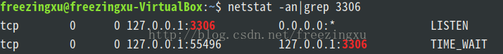
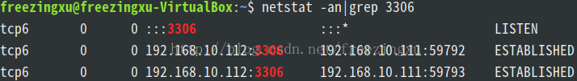

# 在Ubuntu/Linux环境下使用MySQL：开放/修改3306端口、开放访问权限

原文：https://blog.csdn.net/freezingxu/article/details/77088506

## 查看3306端口是否开放
```bash
netstat -an|grep 3306
```
如下图则没有开放：



## 修改访问权限
进入目录“etc/mysql/mysql.conf.d/”，如下图所示：


打开配置文件mysqld.cnf，注释掉：
```bash
# bind-address = 127.0.0.1  
```

## 修改端口号
在[mysqld]中加入：
```bash
port = 3306
```
保存退出。

## 开放用户root的权限
root用户进入数据库，进入mysql数据库。

将user表中user='root'一行的host改为'%'。

然后开放root用户的所有权限：
```mysql
grant all privileges on *.* to 'root'@'%' identified by '你的root账户密码';  
flush privileges;​  
```

## 最后查看3306端口的状态
如果看到下图这样，就可以了：

