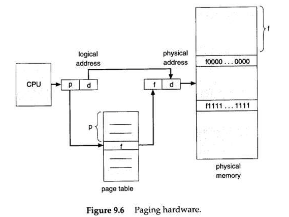

# markdown笔记

记录一些写markdown过程中的笔记。

# 居中的方法

使用`<center>`，但该方法只适用于文字：

<center>居中的文字</center>

使用`<div align=center></div>`，该方法适用于图片和文字，且能够将一块图片和文字都居中：

<div align=center>



居中的图片以及文字

</div>

# 数学公式

有趣用法1：

```markdown
\underset{i}{max}
```

结果：

$$ \underset{i}{max} $$
