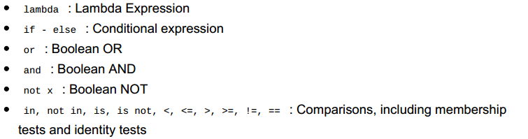
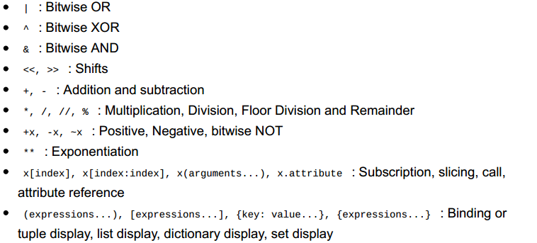

# A Byte of Python reading notes

## 基础

### 注释

以'#'开头的任何文本都是注释：

```python
# print function
print('hello world')

print('hello world') # print function
```

### 字面常量

字面常量的例子有：数字如5，1.23，字符串如"This is a string"或者'This is a string'。

之所以被称为常量，是因为字面常量2永远代表数字2，它不能改变。

### 数字

数字有两种类型：整型和浮点型。

整型的例子如字符常量2。

浮点型的例子如3.23和52.3E-4。

注意：Python中没有long类型，int类型可以是任意大小的。

### 字符串

字符串由一个字符序列组成。

#### 单引号

可以使用单引号来声明字符串：'Quote me on this'。

引号内的所有空间，如空格和制表符，都会得到保留。

#### 双引号

在双引号内声明的字符串的工作机理和在单引号中的一模一样："What's your name?"。

#### 三引号

可以使用三引号来声明多行的字符串。在三引号当中，你可以随意使用单引号或者双引号：

```python
'''This is a multi-line string. This is the first line.
This is the second line.
"What's your name?," I asked.
He said "Bond, James Bond."
'''
```

#### 字符串是一成不变的

这意味着当你创建一个字符串后，你就不能够改变它。这看起来像是一件坏事，其实不然。在后面的程序例程当中我们将会发现这并不是一个糟糕的限制。

#### 格式化方法

有时候我们想要用其他的信息来对字符串进行构造。此时 format() 方法十分有用：

```python
name = "SunnyChen"
age  = 22

print("{0} is {1} years old.".format(name, age))
print("{0} is studying python".format(name))
```

输出：

```
SunnyChen is 22 years old.
SunnyChen is studying python
```

格式化中的括号是可选的，你也可以这样来使用：

```python
name = "SunnyChen"
age  = 22

print("{} is {} years old.".format(name, age))
print("{} is studying python".format(name))
```

这样得到的结果是一样的。当然，此时括号按照format中参数的顺序进行匹配。

此外你还可以在括号中命名参数：

```python
name = "SunnyChen"
age  = 22

print("{name} is {age} years old.".format(name=name, age=age))
print("{name} is studying python".format(name=name))
```

在Python 3.6中引入了更为简短的方法来命名参数，叫"f-strings"方法：

```python
name = "SunnyChen"
age  = 22

print(f"{name} is {age} years old.")
print(f"{name} is studying python")
```

Python在 format 方法当中所做的事情，就是将每个参数替换到格式所在的位置，下面展示更多的细节方法：

```python
# 浮点数保留小数点后3位
print("{0:.3f}".format(1.0/3))
# 使用'_'来将"test"扩充到13个字符长
print("{0:_^13}".format("test"))
# 显式指定format中的参数
print("{name} reading {str}".format(name=name, str="books"))
```

输出：

```
0.333
____test_____
SunnyChen reading books
```

更多具体的格式参见：https://docs.python.org/3/library/string.html#formatspec

print 方法输出的字符串，隐式使用'\n'结尾，因此 print 方法输出的字符串都会自动换行。如果要让 print 方法的不以'\n'结尾，需要显式声明：

```python
print('a', end='')
print('b', ehd='')
```

#### 转义序列

带来这个问题的是在字符串中使用符号'的问题，在Python中有两种解决的方法，一种是使用转义字符\'，另一个方法就是使用双引号来声明字符串：

```python
print("test'test'") # 输出：test'test'
```

当然，使用双引号声明的字符串，在字符串中使用双引号同样要使用转义字符。

其他转义字符的使用和一般高级语言的用法一致，这里不再赘述。

另外可以说明的一点是，在字符串声明中'\'的用途是在一行字符串的结尾中使用，表明不会新开一行，如下：

```python
str  = "one line. \
       another line."
print(str)
```

输出：

```
one line.        another line.
```

#### 原始字符串

如果需要指定未经过特殊处理的字符串如转义序列，可以在字符串之前用r或者R来声明：

```python
r"Newlines are indicated by \n"
```

值得注意的是，在处理正则表达式的时候要全程使用原始字符串。

### 变量

#### 标识符命名

Python的标识符命名规则：

- 标识符的第一个字符必须是大小写的字母或者下划线。
- 标识符剩下的部分可以包括大小写字母或者Unicode的字符或者下划线。
- 标识符是大小写敏感的。

#### 数据类型

基本的数据类型包括数字和字符串。在后面的部分介绍使用类（classes）来创建自己的数据类型。

#### 对象

Python将在程序中的任何内容统称为对象，这是一种一般的说法。对于使用面向对象编程的用户来说：Python是强面向对象的，一切都是对象，包括数字、字符串和函数。

对于静态语言程序员来说，要注意的是：Python中的变量使用它们只需要给它们赋值即可，不需要声明它们的数据类型。

### 逻辑行和物理行

一个物理行（physical line）是指你在程序中所看到的写的内容。一个逻辑行（logical line）是python所看到的单个语句。Python会假定每一个物理行对应一个逻辑行。

Python不像C++等语言，每一行都需要以';'结尾，但是如果你想在一个物理行上写多个逻辑行，那么就需要使用';'来进行分隔：

```python
i = 5
print(i)
```

相当于：

```python
i = 5;
print(i);
```

也相当于：

```python
i = 5; print(i);
```

然而，极力不推荐你使用最后一种方式来书写Python程序。一般来说，另外一个有关的比较有用的用法是使用反斜杠'\'来分隔一条很长的逻辑行：

```python
s = 'This is a string. \
This continues the string.'
print(s)
```

当然，有时候可以不用显式使用反斜杠来标明逻辑行的分隔，比如在括号开头的逻辑行当中，这被称为隐式行连接（implicit line joining）。

### 缩进（Indentation）

Python中每一行开始的空白是很重要的（缩进）。在逻辑行开头留下空白区（使用空格或者制表符）可以定义逻辑行的缩进级别，从而定义逻辑行的语句分组。

这意味着放在一起的语句必须拥有相同的缩进，这样的一组语句称为块（block）。

下面的例子就是错误的缩进示范：

```python
i = 5
# 下面的逻辑行是错误的，自行缩进了一个空格
 print('Value is', i)
print('I repeat, the value is', i)
```

当运行这个程序就会报错：

```
File "whitespace.py", line 3
print('Value is', i)
^
IndentationError: unexpected indent
```

上面的例子告诉我们，不能够自己任意的新开一组表达式的块（除非是默认的main主块）。关于新开块的细节将会在之后说明，比如控制流（条件语句块）。

Python官方的缩进建议：4个空格，可以将制表符设定为这个值来缩进。

对静态语言程序员需要注意的是：Python不会使用大括号来表示块，只能使用缩进的形式来表示。

## 运算符和表达式

### 运算符

Python中一些常用的运算符：+ - * **（乘方） / //（整除） % << >> & | ^ ~ < > <= >= == != not（布尔非） and or 等等

详细的运算符信息参考：https://docs.python.org/3/library/operator.html#module-operator

### 数值运算与赋值的快捷方式

变量 = 变量 运算符 表达式 => 变量 运算符 = 表达式

### 求值顺序

详细的求值顺序参见：https://docs.python.org/3/reference/expressions.html?highlight=evaluation%20order#evaluation-order

下面给出一个大致的顺序，从最低优先级到最高优先级：





### 改变求值的顺序

使用括号：2 + 3 * 4 => (2 + 3) * 4

### 结合性（Associativity）

运算符的结合性是从左到右，意味着相同优先级的运算符从左到右的方式依次求值。比如，2 + 3 + 4 等同于 (2 + 3) + 4。

### 表达式

示例：

```python
length = 5
breadth = 2

area = length * breadth
print('Area is', area)
print('Perimeter is', 2 * (length + breadth))
```

输出：

```
Area is 10
Perimeter is 14
```

可以注意到的是，Python是如何漂亮的进行输出的。我们在'Area is'之后没有声明一个空格，但是在打印的时候却自动加上了一个空格使得输出更容易阅读。

## 控制流

### if语句

Python中if语句块的格式：

```
if [conditions]:
    # statements
elif [conditions]:
    # statements
else:
    # statements
```

当然，使用if语句块可以是if-else、if-elif-else的形式，或者只是用if语句。
