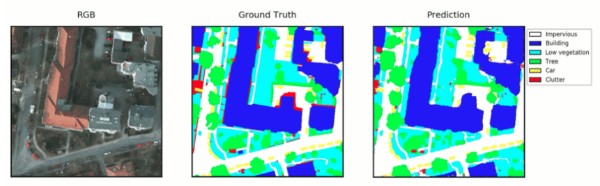
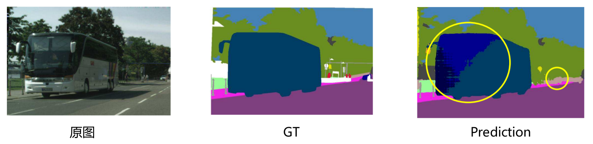
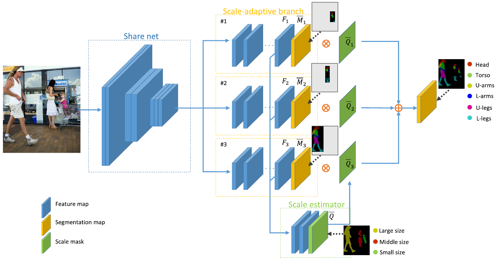
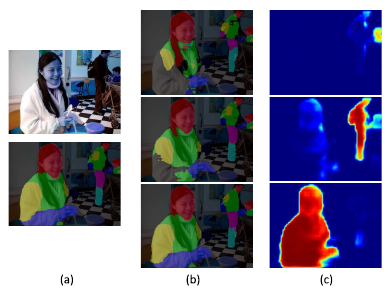

# 基于尺度自适应网络的图像语义分割探究

## 摘要

图像的语义分割是在计算机视觉当中的一个重要研究问题，它指的是在像素的级别上识别图像，标注出图片中每个像素所属的标签。图像的语义分析同时也是一个在计算机视觉领域十分重要且还没有被解决的难题，其中比较重要的挑战在于目标尺度的多样性。而在2019年发表在TIP中的一篇文章中，作者使用了尺度自适应网络（Scale-Adaptive Network，SAN）来解决这个难题。作者所提出的SAN中，包含了多个分支，每个分支负责对特定尺度范围的目标进行分割。SAN由一个共享网络，三个尺度自适应的分支，一个尺度度量器和一个基于尺度的融合网络组成。作者的方法在PASCAL-Person-Part，PASCAL VOC 2012，Cow-Horse-Sheep和LIP数据集上训练的准确度相比其他方法是最优的。本报告针对作者提出的基于尺度自适应网络的图像语义分割进行探究。

**关键词**：语义图像分割，计算机视觉

## 绪论

分割（Segmentation）是计算机视觉中的一类重要问题，其指的是将数字图像细分为多个图像子区域的过程，分割的方法也有很多，包括语义分割（Semantic Segmentation）、实例分割（Instance Segmentation）以及全景分割（Panoptic Segmentation）等。图像分割在实际生活中的应用也非常多，包括医学影像、卫星图像中定位物体、人脸识别、指纹识别等等。

而语义图像分割则是典型的计算机视觉问题，它的主要工作在于将图像中的每个像素赋予一个类别标签。也就是说，语义分割是在像素级别上来处理、理解图像的。在宏观意义上来说，语义分割是场景理解的一种高层任务，其作为计算机视觉的核心问题，现实生活中场景理解的重要性越来越突出，因为现实中越来越多的应用场景需要从影像中推理出相关的知识或语义。语义图像分析除了上述的图像分割的普遍应用之外，还有许多其他重要的应用：

- 无人驾驶。语义分割也是无人驾驶的核心算法技术。车载摄像头或者激光雷达将探查到的图像输入到神经网络当中，而后台的计算机自动将图像分割归类，以避让行人和车辆等障碍。
- 精确农业。语义分割可以帮助农业机器人调整需要在田间喷洒的除草剂的数量，区分作物和杂草的语义分割可以帮助它们实时触发除草的行为，这种先进的农业图像视觉技术可以减少对农业的人工监测，提高农业效率和降低生产成本。

图1 语义分割应用在地理信息系统上，自动识别道路、河流、庄稼、建筑物等

如图1所示，是一个应用于卫星信息遥感当中，对地理信息系统进行语义分割的具体实例应用。图一最左是原图，中间是对原图进行语义分割得出的正确结果，而最右则是应用语义分割所得到的结果。图像分割所得到的结果，可以用于定位物体，生成地图等等。

需要注意的是，语义分割不同于实例分割。对于语义分割来说，只需要将所有的人归为一类，而对于实例分割来说，每个不同的人都要归为不同的类，也就是说，实例分割比语义分割要更近一步。

在深度学习方法流行之前，语法分割的传统方法当中使用的比较多的是TextonForest和基于森林分类器等的语义分割方法。在CNN流行之后，基于深度学习的方法比传统方法的结果提升很多。在这里详细介绍进行语义图像分割的深度学习方法。

Patch Classification是最初应用到图像分割的深度学习方法，其将图像切成块作为深度模型的输入，然后对像素进行分类。由于神经网络的限制，全连接层需要固定大小的图像，因此原图像需要切成大小相同的块作为输入。全卷积网络（FCN）将网络全连接层使用卷积取代，因此图像的输入可以变为任意大小，并且速度比Patch Classification要快很多。然而CNN模型由于使用了下采样操作（pooling），其对于高层次的任务来说是很有效的，但是pooling降低了分辨率，削弱了位置信息，而语义分割中需要丰富的位置信息，因此将CNN应用与语义分割仍然存在一定的问题。为了解决这一问题，Encoder-Decoder架构被提出。其基于的仍然是FCN架构，encoder使用pooling逐渐减少空间维度，而decoder逐渐回复空间维度和细节信息。此外还有空洞卷积、条件随机场等方法，在这里不再一一赘述。

此外，在作者的原文中，提到了解决尺度问题的一些相关的解决思路：

- Skip-net架构。该架构使用了多种不同层级的网络来适应不同尺度的特征；
- Share-net架构。包含有三种比较通用的方法来解决尺度问题：
  - 尺度平均池化（average-pooling over pooling）
  - 尺度最大池化（max-pooling over scales）
  - Attention model

- 检测分割级联网络（Detection-segmentation cascade network）。该方法每当检测到一个目标时，将会获取这个目标的尺度，然后将图像放缩到适当的比例来优化解析的过程。
- 变形卷积（Deformable Convolution）。该方法是通过将卷积层设计为动态的且可自我学习来提升其性能。

而在TIP 2019这篇文章中，作者的主要工作则是提出了尺度自适应网络（Scale-Adaptive Network，SAN）来解决尺度的问题。尺度问题具体上来说，就是在进行语义图像分割的过程中，对大小不一的尺度的问题进行处理的时候所存在的问题。如图2所示，当一个物体的尺度比较大（巴士、飞机、轮船）时，进行语义分割的过程中同一个物体中的像素可能会被错误的赋予不同的标签。而当一个物体的尺度比较小（街上背景中的行人、飞鸟）时，进行语义分割的过程中则可能会被忽略，而被划分到和背景相同的标签当中。

图2 语义图像分割中的尺度问题

对于SAN来说，在训练的阶段，SAN会首先量化目标的尺度，并基于训练数据集中目标的边框大小将这些尺度分成$T$个集合。对于一个进行训练的图片来说，训练过程中正确的标注（ground truth annotation）不单止包含目标的类别标签，还包含有尺度的标签，取值范围从1到$T$。

SAN包含有一个具有$T$个分支的共享全连接网络，如图3所示。 每个分支负责对特定的尺度大小的目标进行分割，因此在训练的阶段当中，每个分支会预测对应尺度目标像素的类别标签。除了类别标签以外，SAN还会预测每个像素的尺度标签来为整个图片生成一个尺度标签信息图。最后输出的特征图则是$T$个分支根据尺度标签信息所融合得到的最终分类标签图。

图3 SAN概览。如图所示，卷积网络的顶层是一个共享网络，作者使用了3个包含多个卷积层的尺度自适应的分支来分割对应尺度大小的目标。尺度估计器将各个分支生成的级联特征图作为输入，以此生成对应的尺度标记信息。最后，尺度标记信息会用于选择以及融合由各个尺度自适应的分支生成的高质量结果，并呈现在最后的分割图当中。

图4是一个使用SAN来分割人的语义信息的结果图。中间的一列说明了每个分支都能够预测每个像素的尺度，最右的一列说明了SAN可以准确的预测尺度信息。

图4 使用SAN来分割人的语义信息的结果图。(a)输入的图像以及最终的合理分割结果。(b)尺度诱导下生成的分割图。(c)尺度标签信息图。最终的分割结果由每个尺度诱导分割图根据尺度信息结果加和所得到。

总的来说，作者所提出的SAN所包含的多个尺度自适应的分支可以很好的分割对应尺度大小的目标而不需要特征金字塔（feature pyramid）或者图像金字塔（image pyramid），并且能够在多个不同的数据集上在和其他方法的对比上取得了最高的准确度（单个网络）。

## 尺度自适应网络

在这一章节当中，将会详细描述SAN的各项细节，包括问题描述、网络具体结构、尺度度量器等。

### 问题描述

语义分割的任务是预测