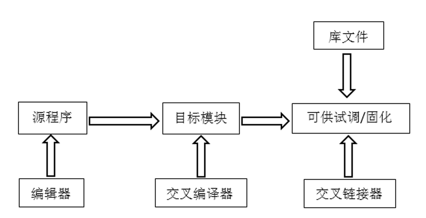

# 嵌入式系统概述

## 1.1 嵌入式系统简介

### 1.1.1 嵌入式系统的定义

内涵上定义：以应用为中心，计算机技术为基础，软、硬件可裁剪，适应应用系统对功能、可靠性、成本、体积、功耗严格要求的专用计算机系统。

外延上定义：把数字计算机分成通用计算机和嵌入式系统两大类。通用计算机是指如微型计算机（PC）、大型计算机、服务器等，除此指代的计算机称为嵌入式系统。

### 1.1.2 嵌入式系统的特点

1. 面向特定应用
2. 较低的成本
3. 较好的便携性
4. 功耗很低
5. 很好的支持能力
6. 很好的可靠性
7. 不具备自开发能力

#### 嵌入式系统与通用计算机的区别

- 嵌入式系统通常面向特定的应用
- 嵌入式系统是将先进的计算机技术、半导体技术和电子技术以及各个行业的具体应用相结合的产物
- 嵌入式系统的硬件和软件必须进行高效率的设计
- 嵌入式系统的应用软件取决于行业背景
- 嵌入式系统与具体应用有机结合在一起
- 嵌入式系统不具备自开发能力

## 1.2 嵌入式系统芯片

### 1.2.1 嵌入式微控制器（MCU）

又称为单片机。微控制器是目前嵌入式系统工业的主流。

特点：
- 单片化，体积大大减小。
- 功耗和成本较低，可靠性提高。
- 片上外设资源一般比较丰富，适合于控制。

代表性设备：51单片机、AVR单片机、PIC单片机、Freescale单片机、NXP单片机、TI MSP430单片机、STM8单片机、ARM单片机。

### 1.2.2 嵌入式微处理器（MPU）

是由通用计算机中的CPU简化而来，只保留了于嵌入式应用密切相关的功能部件。

特点：
- 功耗低
- 处理器结构可扩展
- 存储保护
- 调试功能丰富
- 支持实时多任务

代表性设备：MIPS芯片、ARM芯片、Power PC芯片等。

### 1.2.3 嵌入式数字信号处理器（DSP）

一种非常擅长于高速实现各种数字信号处理运算的嵌入式处理器。

特点：
- 多总线结构
- 流水线操作
- 专用的硬件乘法器
- 特殊的DSP指令
- 多机并行运行特性
- 快速的指令周期
- 低功耗
- 高的运算精度

### 1.2.4 嵌入式片上系统（SOC）

结合了许多功能模块，将整个系统集成在一个芯片上。并且是可编程系统，是采用FPGA设计的ASIC电路。

## 1.3 嵌入式系统硬件和软件的基本组成

### 1.3.1 嵌入式系统硬件基本组成

#### 基本电路：电源、重启电路和时钟电路

一个嵌入式系统电路正常工作需要至少**电源、重启（Reset）和时钟电路**三部分电路。重启电路主要包括上电重启电路和按钮重启电路。

#### 存储电路：RAM和ROM

RAM主要用于存放数据，ROM主要用于存放程序。嵌入式系统中常用的存储类型：

1. 随机存储器RAM

    主要有SRAM和DRAM两种类型。

2. 只读存储器ROM

    掩膜ROM、PROM、EPROM、EEPROM、Flash存储器。

    其中Flash存储器主要有两类：NAND Flash和NOR Flash。其中NOR可以直接使用，而NAND需要I/O接口，因此使用时需要驱动，在启动时由Bootloader来进行加载。

#### 模拟电路————模数转换（AD）和数模转换（DA）

#### 其他常用接口电路

- 通用输入输出接口（GPIO）
- 键盘接口
- 显示接口
- 串行接口
- 总线接口

### 1.3.2 嵌入式系统软件系统

#### 嵌入式裸机软件系统

没有专门的操作系统，无操作系统嵌入式软件的具体实现方法有两种：循环轮换和前后台系统。

循环轮换：把系统功能分解为若干个不同的任务，然后把它们包含在一个永不结束的循环语句当中，按照顺序逐一执行。当执行完一轮循环后，又回到循环体的开头重新执行。

前后台系统： 在循环轮换的基础上，加入了中断处理功能。中断服务程序构成了前台程序，负责处理异步事件。后台程序一般是一个无限循环，负责掌管整个嵌入式系统软、硬件资源的分配、管理以及任务调度。（这实际上不就是一个简单的操作系统吗？）

#### 嵌入式操作系统软件系统

在操作系统的基础上编写，易于实现功能复杂、系统庞大的应用。

## 1.4 嵌入式系统开发

### 1.4.1 嵌入式系统芯片选型

从功能、字长、处理速度、工作温度、功耗、寻址能力、平均故障间隔时间、性能价格比、工艺、电磁兼容性指标、芯片封装类型等各种参数中进行选择。

### 1.4.2 嵌入式系统硬件设计

需要关注以下几点：
- 电源确定
- 晶振确定
- 预留测试IO口
- 外扩存储设备
- 功能接口
- 屏幕等

### 1.4.3 嵌入式软件开发及编译

使用开发环境如Keil SDK等工具编辑好源代码后，使用交叉编译器编译成目标模块代码，再使用交叉链接器结合库文件链接成可供调试和固化的目标程序，使用JTAG下载器下载到芯片当中。

### 1.4.4 嵌入式系统下载及调试

常用调试器：ROM Monitor、ROM Emulator、In-Circuit Emulatorh和On Chip Debugging。

## 1.5 嵌入式系统芯片的发展趋势

- 嵌入式系统芯片的网络化
- 嵌入式系统芯片更高的集成度
- 嵌入式系统芯片的并行及多核化
- 嵌入式系统芯片内核开发集成化
- 嵌入式系统芯片设计的类人脑化
