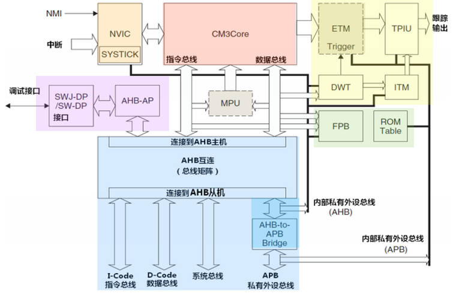

# ARM芯片及体系架构

## 2.1 ARM芯片主要类别

1. 经典ARM处理器：低成本解决方案

    ARM7系列————基于ARMv4T架构面向普通应用的经典处理器。该芯片没有MMU，只能运行ucLinux操作系统。

    ARM9系列————基于ARMv5架构的常用处理器。

    ARM11系列————基于ARMv6架构的高性能处理器。

2. ARM处理器Cortex-M系列：面向成本敏感的微控制器解决方案

    Cortex-M系列面向成本敏感的微控制器提供解决方案，主要针对为控制领域开发。主要芯片包括Cortex-M0、Cortex-M3和Cortex-M4。

    Cortex-M3基于ARMv7M架构。

3. ARM处理器Cortex-A、Cortex-R系列

    Cortex-A系列是以Cortex-A5、Cortex-A7、Cortex-A8、Cortex-A9、Cortex-A15为代表的应用类Cortex处理器。这些开放式处理器具有**高性能兼容的操作系统软件支持**。所有该类的处理器都共享共同的架构和功能集，在开放式平台之间实现软件的兼容性和可移植性。

    Cortex-R系列实时处理器要求可靠性、高可用性、容错功能、可维护性和实时响应的嵌入式系统提供高性能计算解决方案。

## 2.2 ARM处理器体系结构

### 2.2.1 ARM处理器体系结构

ARM 32-bit ISA：基于RISC原理的32位ARM指令集。

Thumb 16-bit ISA：对32位ARM指令集的扩展，是已压缩至16位编码的最常用的32位ARM指令集的扩展。

Thumb-2：提供最佳代码大小和性能的基于ARM Cortex体系结构的指令集。

VFP：浮点体系结构，为半精度、单精度和双精度浮点运算中的浮点操作提供硬件支持。

Jazelle技术：提高执行环境（Java、Net、MSIL等）的速度。

TrustZone安全扩展：提供可信计算，是系统范围的安全方法。

SIMD：当前的只能手机和Internet设备必须提供高级媒体和图形性能，SIMD扩展改进了此类性能。

NEON：通用SIMD引擎可有效处理当前和将来的多媒体格式，从而改善用户体验。

Virtualization：虚拟处理器技术。

**NVIC：Cortex-M系列处理器在内核上搭载了的嵌套向量中断控制器，与内核有紧密的耦合**，NVIC提供的功能：
- 可嵌套中断支持
- 向量中断支持
- 动态优先级调整支持
- 中断延迟大大地缩短
- 中断可屏蔽

WIC：唤醒中断控制器。

## 2.3 ARM Cortex-M3简介

### 2.3.1 Cortex-M3功能说明

Cortex-M3是一个32位处理器内核，采用**哈佛**结构，拥有独立的指令总线和数据总线，可以让取指与数据访问并行不悖。处理器架构使用三级流水线，带有分支预测功能，提供有可选的内存保护单元，但是没有MMU。

Cortax-M3内核架构图：



### 2.3.2 Cortex-M3的总线接口

#### I-Code总线

基于AHB-Lite总线协议的32位取指操作总线。

#### D-Code总线

基于AHB-Lite总线协议的32位数据访问总线。

#### 系统总线

基于AHB-Lite协议的特定内存地址的数据传送。

#### 外部私有外设总线

基于APB总线协议的32位总线，负责特定内存范围的私有外设访问。

### 2.3.3 寄存器组说明

Cortex-M3处理器拥有如下寄存器：

#### 通用寄存器R0~R12

#### 堆栈指针R13

Cortex-M3具有两种堆栈指针，支持两个堆栈，分别是进程堆栈和主堆栈。这两种堆栈都指向R13。任意时刻进程堆栈或者主堆栈中只有一个是可见的。当引用R13时，引用的是正在使用的那一个，另一个必须用特殊的指令来访问（MRS或MSR指令）。这两个堆栈指针的基本特点如下：

主堆栈指针（MSP）。默认的堆栈指针，由操作系统内核、一场服务例程以及所有需要特权访问的应用程序代码来使用。

进程堆栈指针（PSP）。用于不处于异常服务例程中的常规的应用程序代码。

在处理模式和线程模式下，都可以使用MSP。但只有线程模式能使用PSP。

#### 链接寄存器（LR）R14

链接寄存器用于在调用子程序时存储返回地址，也可用于异常返回。

#### 程序计数寄存器R15

#### 特殊功能寄存器

包括程序状态字寄存器组（PSRs）、中断屏蔽寄存器组和控制寄存器。

1. xPSR

    xPSR是程序状态寄存器组。CPSR是当前程序状态寄存器，在任何处理器模式下都可以被访问。CPSR中含有条件码标志、中断禁止位、当前处理器模式以及其他状态和控制信息。每一种处理器模式下都有一个专用的物理状态寄存器，称为SPSR（备份程序状态寄存器）。

    CPSR包括条件码标志位、保留位和控制位。最高4位N、Z、C、V称为条件码标志，条件执行的指令通过检测这些条件码标志来决定程序指令如何执行：

    N：运算结果是有符号的二进制补码的情况下，如果结果为负数，则N=1。否则N=0。

    Z：如果结果为0，则Z=1；否则Z=0。

    C：加法操作产生进位，则C=1。减法操作产生借位，C=0。

    V：有符号整数加减运算，若发生溢出，则V=1；否则V=0。对于其他指令V通常不变。

2. PRIMASK

3. FAULTMASK

4. BASEPRI

5. CONTROL

    定义特权状态，并且决定使用哪一个堆栈指针：

    <table>
        <tr>
            <th></th>
            <th>CONTROL[0]</th>
            <th>CONTROL[1]</th>
        </tr>
        <tr>
            <th>0</th>
            <th>特权级的线程模式</th>
            <th>选择主堆栈指针MSP（复位后的默认值）</th>
        </tr>
        <tr>
            <th>1</th>
            <th>用户级的线程模式</th>
            <th>选择进程堆栈指针PSP</th>
        </tr>
    </table>

### 2.3.4 操作模式和特权级别

Cortex-M3支持两种处理器的操作模式，以及两种特权操作。两种模式为处理者模式和线程模式。特权的分级为特权级和用户级。目的是为了提供一种存储器保护机制。

在运行主应用程序时（线程模式），既可以使用特权级，也可以使用用户级。但是异常服务例程（处理者模式）必须在特权级下运行。

对于特权级的用户模式和用户及的线程模式。复位后，处理器默认特权级的线程模式，并且可以方便的切换回到用户级的线程模式（通过修改CONTROL[0]即可，因为特权级模式下可以访问所有的寄存器和执行所有的指令，使用MSR指令置位CONTROL[0]即可）。但是在用户级状态下要进入特权级，需要执行SVC系统调用指令，触发SVC异常，通过异常服务例程接管并批准进入后才能修改CONTROL寄存器，从而进入特权级。

主堆栈指针和进程堆栈指针的切换与特权级和用户级模式的切换相似。MSR指令可以置位和清零CONTROL[1]来改变R13的指向。

综上所述，线程模式+进程堆栈指针多用于操作系统的应用程序任务状态。特权处理模式+主堆栈指针多用于中断状态。

### 2.3.5 处理器映射

Cortex-M3支持4GB的存储空间（32位地址）。内存中由两种格式存储字数据：

- 大端格式：高位数据存放在低地址，低位数据存放在高地址。
- 小端格式：低位数据存放在低地址，高位数据存放在高地址。

Cortex-M3支持的数据类型由32位字、16位半字以及8位字节。支持非对齐的传送，数据存储器的访问无需对齐。

### 2.3.6 流水线

Cortex-M3使用三级流水线，分别时取指、解码和执行。当遇到分支指令时，解码姐u但也包含取指预测。

### 2.3.7 异常和中断

中断对于Cortex-M3核是来自于内核的外面，而异常则是来自于内核活动的产生。

Cortex-M3具有15个异常，并且每种异常都有优先级，其中优先级数值越小表明该异常的优先级越高。其中，优先级最高的前三个异常：复位、不可屏蔽中断（NMI）、硬件失效，对应的优先级为（-3、-2、-1），这三个异常的优先级不可改变。其他所有异常的优先级都是可以设置的，但是不能设置为负数。

嵌套向量式中断控制器NVICi基本功能包括支持向量中断、可屏蔽中断、支持嵌套中断以及动态优先级调整。

#### 有哪些异常？

复位、不可屏蔽中断（NMI）、硬件失效等等。

#### 有哪些中断？

窗口定时器中断、侵入检测中断、闪存全局中断等等。

### 2.3.8 存储器保护单元

MPU可以对特权级访问和用户级访问施加不同的访问限制。

## 2.4 ARM指令汇编

ARM处理器时基于RISC原理设计的，指令集较为简单。

### 2.4.1 汇编寻址方式

#### 寄存器寻址

#### 立即寻址

#### 寄存器移位寻址

当第二个操作数是寄存器移位方式时，第2个寄存器操作数在于第1个操作数结合之前先进行移位操作。例子：
```ARM
MOV R0, R2, LSL #3      @R2的值左移3位后将结果放入R0
```

#### 寄存器间接寻址
```ARM
LDR R1, [R2]
```

#### 基址寻址

将基址寄存器的内容与指令中给出的偏移量相加，形成操作数的有效地址：
```ARM
LDR R2, [R3, #0x0C]     @读取R3的内容，读取存储中其与0x0C相加后产生的地址中的内容到R2中
```

#### 多寄存器寻址

一次可传送几个寄存器值，注意第一第二寄存器的意义发生了改变：
```ARM
LDMIA R1!, {R2-R7, R12}     @将R1指向的单元中的数据读出到R2~R7、R12中
```

#### 堆栈寻址

#### 相对寻址

由PC提供的基准地址进行相对寻址。

### 2.4.2 ARM汇编语言

ARM微处理器的指令集时加载/存储型的，其中可以分为6大类：**跳转、数据处理、程序状态寄存器处理、加载/存储、协处理器和异常产生**。

ARM指令的基本格式：
```
<opcode> {<cond>} {S} <Rd>, <Rn>{, <operand2>}
```
- opcode：指令助记符
- cond：执行条件
- S：是否影响CPSR寄存器的值
- Rd：目标寄存器
- Rn：第1个操作数的寄存器
- operand2：第2个操作数

#### operand2：第2个操作数

第2个操作数可以有以下形式：

1. #immed_8r————常数表达式

    该常数必须对应8位位图，必须是一个8位的常数通过循环右移偶数位可以得到的数。

    关于为何要使用这样的规定，可以从ARM指令编码格式上说明：

    <table>
        <tr>
            <th>31 - 28</th>
            <th>27 - 25</th>
            <th>24 - 21</th>
            <th>20</th>
            <th>19-16</th>
            <th>15-12</th>
            <th>11-0</th>
        </tr>
        <tr>
            <th>cond</th>
            <th>001</th>
            <th>opcode</th>
            <th>S</th>
            <th>Rn</th>
            <th>Rd</th>
            <th>shifer_operand</th>
        </tr>
    </table>

    由于第2个操作数只有12位的空间，来表示32位的数是不可能的，这里可以这样使用：8位数字，4位移位。由于4位移位还是不能完全覆盖所有的32位数字，因此只好定义只能移动偶数位，4位有16种移位的情况，而32位数据可以移位32次，因此只能取一半（即偶数）了。

2. Rm————寄存器方式

    在寄存器方式下，操作数即为寄存器的数值。

3. Rm, shift————寄存器移位方式

    将寄存器的移位结果作为操作数，但Rm值保持不变，移位方法如下：

    - ASR #n：算术右移n位
    - LSL #n：逻辑左移n位
    - LSR #n：逻辑右移n位
    - ROR #n：循环右移n位
    - RRX：带扩展的循环右移1位
    - Type Rs：Type为一种移位类型，Rs为偏移量寄存器，低8为有效

    ```ARM
    ADD R1, R1, R1, LSL#3       @ R1 = R1 + R1 * 8
    ```
    
#### ARM指令集————条件码

绝大部分的ARM指令都可以条件执行。如果指令不表明条件码，将默认为无条件（AL）执行。例子：
```C
if (a > b)
    a++;
else b++;
```

对应的ARM汇编代码：
```ARM
@整型a存放在寄存器R0，整型b存放在寄存器R1。a、b为无符号整型
CMP     R0, R1          @R0与R1进行比较，对CPSR进行置位
ADDHI   R0, R0, #1      @若a > b，则a递增
ADDLS   R1, R1, #1      @若a <= b，则b递增
```

#### ARM指令种类

##### 存储器访问指令

存储器访问指令分为单寄存器操作指令和多寄存器操作指令。

1. 单寄存器存取

    指令格式：

    <table>
        <tr>
            <th>装载指令</th>
            <th>LDR     目标寄存器, 源地址</th>
        </tr>
        <tr>
            <th>保存指令</th>
            <th>STR     源寄存器, 目标地址</th>
        </tr>
    </table>

    要注意上述操作的数据流向：装载指令中数据从源地址读到目标寄存器中；而保存指令将源寄存器中的数据保存到目标地址中。

    LDR/STR指令用于对内存变量的访问、内存缓冲区数据的访问、查表、外围部件的控制操作等。

    LDRx/STRx可以通过搭配不同的后缀实现不同方式的单寄存器存取操作：字/半字/字节数据控制；是/否用户模式控制；无/有符号控制等等。

    源地址和目标地址有多种表达形式：
    - 立即数：可以单单是一个立即数，也可以将这个数加到基址寄存器上
    - 寄存器：可以单单是一个寄存器，也可以将寄存器中的数值加到基址寄存器上
    - 寄存器及移位常数：寄存器移位后的值可以加到基址寄存器：
    ```ARM
    LDR R1, [R0, R2, LSL #2]    @将(R0 + R2 * 4)d地址所指向的存储单元的值读出到R1中
    ```

    同时，偏移的形式也有多种：
    - 零偏移：
    ```ARM
    LDR Rd, [Rn]
    ```
    - 前索引偏移：
    ```ARM
    LDR Rd, [Rn, #0x04]!    @将Rn+0x04之后的内存地址中的数据加载到Rd中，然后更新Rn的值为Rn = Rn + 0x04。如果没有"!"，则不会进行更新，而只是普通的偏移。
    ```
    - 程序相对偏移：
    ```ARM
    LDR Rd, label
    ```
    - 后索引偏移：
    ```ARM
    LDR Rd, [Rn], #0x04     @将Rn中的地址指向的内存中的数据加载到Rd中，然后更新Rn = Rn + 0x04
    ```

2. 多寄存器存取

    指令格式：

    <table>
        <tr>
            <th>装载指令</th>
            <th>LDMx     源地址, 目标寄存器列表</th>
        </tr>
        <tr>
            <th>存储指令</th>
            <th>STMx     目标地址, 源寄存器列表</th>
        </tr>
    </table>

    通过搭配不同的后缀x，实现不同方式地址增长和减少方式：

    数据块传送：
    - IA：每次传送后地址加4
    - IB：每次传送前地址加4
    - DA：每次传送后地址减4
    - DB：每次传送前地址减4

    堆栈操作：
    - FD：满递减堆栈
    - ED：空递减堆栈
    - FA：满递增堆栈
    - EA：空递增堆栈

#### 寄存器和存储器交换指令

SWP指令用于将一个内存单元（该单元地址放在寄存器Rn中）的内容读取到一个寄存器Rd中，同时将另一个寄存器Rm的内容写入到该内存单元中。

指令格式：

<table>
    <tr>
        <th>SWP</th>
        <th>读入寄存器Rd</th>
        <th>输出寄存器Rm</th>
        <th>目标地址</th>
    </tr>
</table>

示例：
```ARM
SWP R2, R1, [R0]    @将R0中数据所指地址的内存单元数据读取到R2中，然后将R1中的数据存储到R0中数据所致地址的内存单元中。
```

#### ARM数据处理指令

1. 数据传送指令

    包括MOV和MVN两种指令，其中MOV指令将8位图立即数或者寄存器传送到目标寄存器，而MVN则是取反后实现传递。

2. 算术逻辑运算指令

    主要包括：
    - ADD：加法运算
    - ADC：带仅为加法运算
    - SUB：减法运算
    - RSB：逆向减法运算
    - SBC：带进位减法运算
    - RSC：带进为逆向减法运算
    - AND：逻辑“与”运算
    - ORR：逻辑“或”运算
    - EOR：逻辑“异或”运算
    - BIC：位清除运算

    具体操作形式：

    <table>
        <tr>
            <th>OpCode</th>
            <th>结果寄存器, </th>
            <th>运算寄存器, </th>
            <th>第二操作数, </th>
        </tr>
    </table>

3. 比较指令

    比较指令将两个数值进行特定运算，根据运算结果影响CPSR的相关标志位，用于后面程序的条件执行，但是运算结果不予保存。有如下的比较指令：
    - CMP: 数值比较
    - CMN：负数比较
    - TST：位测试
    - TEQ：相等测试

#### 乘法指令

MUL、MLA等

#### 分支指令

分支指令主要包括：

- B：分支指令，跳转目标地址基于PC的偏移量，为24位常数
- BL：带链接的分支指令，除了具有跳转功能，还能在跳转之前将下一条指令的地址拷贝到R14链接寄存器中，适用于子程序调用
- BX：带状态切换的分支指令，BX指令除了具有跳转功能，还能在跳转的同时切换处理器状态

#### 协处理器指令

#### 其他指令

SWI：软件中断产生指令

MRS：程序状态寄存器读指令

MSR：程序状态寄存器写指令
```ARM
MRS R1, CPSR    @读取CPSR状态寄存器到R1
```

#### ARM伪指令

NOP：空操作指令

#### 地址对准

在使用ARM指令时要注意地址对准的问题，包括32位的地址对准和16位的地址半字对准。

#### 位段操作

1. 外部接口寄存器的位操作

2. SRAM区的位操作

#### 地址的前缀和后缀
```ARM
LDR R2, [R3, #0x30]     @把R3+0x30地址处的数据加载给R2
LDR R2, [R3], #0x30     @把R3地址处的数据加载给R2，然后R3 = R3 + 0x30
```

#### 指令可选后缀

1. S后缀

使用S后缀时，指令执行后程序状态寄存器的条件标志位将刷新，不使用则不会发生变化。

2. !后缀

使用!后缀时，指令执行后，基址寄存器中的地址将发生变化。注意，!后缀只能使用在下列范围：

- !后缀必须紧跟在地址表达式后面
- !后缀不能使用在R15后面

3. B后缀和H后缀

B后缀：指令所涉及的数据是一个8位字节
H后缀：指令所涉及的数据是一个16位半字
