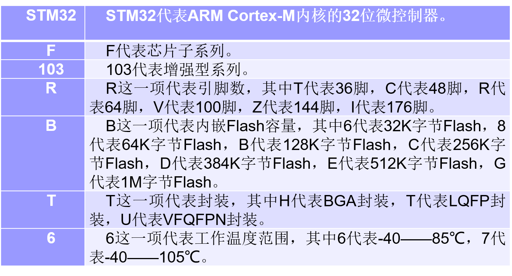
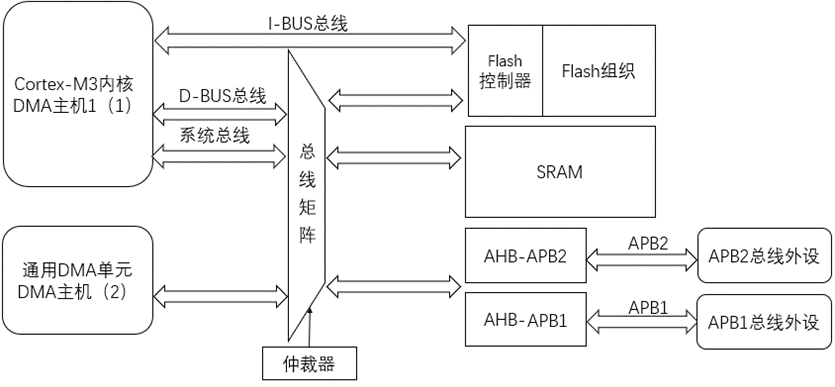

# STM32微控制器及最小系统

## STM32微控制器概述

### STM32微控制器系列

### STM32内部资源

- 内核：ARM 32位Cortex-M3微处理器，主频为72MHz。
- 存储器：128K字节的Flash程序存储器；20K字节的SRAM。
- 时钟、复位和电源管理：2.0 ~ 3.6V供电；上电/断电复位等。
- 低功耗：睡眠、停机和待机模式三种模式。
- 另外还有模数转换器、DMA控制器、多种通信接口、USART接口、同步串行接口以及高级控制定时器等。

### STM32总线系统

其中STM32的Cortex-M3内核通过指令总线与Flash存储器连接，数据总线和系统总线和先进高速总线相连。

### STM32启动设置

通过设置不同的启动模式选择引脚，可以以不同的启动模式来进行启动：

<table>
    <tr>
        <th>BOOT1</th>
        <th>BOOT0</th>
        <th>启动模式</th>
    </tr>
    <tr>
        <th>x</th>
        <th>0</th>
        <th>主闪存存储器</th>
    </tr>
    <tr>
        <th>0</th>
        <th>1</th>
        <th>系统存储器</th>
    </tr>
    <tr>
        <th>1</th>
        <th>1</th>
        <th>内置SRAM</th>
    </tr>
</table>

### STM32下载模式

STM32的下载模式支持两种接口标准：5针的JTAG和2针的SWD串行接口。

同时也可以从系统存储器启动，利用ST公司提供的Bootloader程序利用串口实现对程序的下载。

### STM32最小系统

#### 电源

STM32F103系列微控制器的正常工作电压范围：**2.0 ~ 3.6V**，常规设计一般选用3.3V电源。

#### 复位

支持3种复位模式：**系统复位**、**电源复位**和**存储区复位**。

### 时钟源

#### 外部时钟

- 高速外部时钟（HSE）
- 低速外部时钟（LSE）

#### 内部时钟

- 高速内部时钟（HSI）
- 低速内部时钟（LSI）
- 锁相环倍频输出（PLL）

## 低功耗模式

STM32有3种低功耗模式：
- 睡眠：Cortex-M3停止运行，但是内部外设仍然正常运行，所有SRAM和寄存器内容被保留。
- 停止模式：Cortex-M3停止运行，内部外设停止运行，所有SRAM和寄存器内容被保留。
- 待机模式：Cortex-M3停止运行，内部外设停止运行，所有SRAM和寄存器内容丢失。
