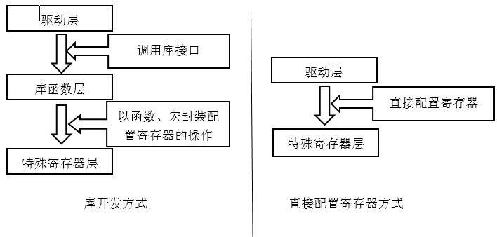

# STM32 库函数及程序开发

## 4.1 STM32固件库

由于STM32单片机的功能强大而灵活，如果使用配置寄存器的方法来进行编程则十分不便。ST公司针对STM32提供函数接口（API），开发者可以通过调用这些函数接口来配置STM32寄存器等：

STM32开发环境：MDK开发环境。

#### 库函数开发的优点

使得开发人员可以脱离最底层的寄存器操作，有开发快速、易于阅读和维护成本低的特点。

### 4.1.1 STM32库结构

1. Libraries文件夹

    Libraries文件夹下是驱动库的源代码和启动文件。为了解决不同芯片厂商生产的Cortex微控制器软件的兼容性问题，ARM与芯片厂商建立了CMSIS标准，这实际上就是新建了一个软件抽象层。

    CMSIS标准中最重要的是CMSIS核心层，包括：
    - 内核函数层：提供了用于访问内核寄存器的名称、地址定义，主要由ARM公司提供。
    - 设备外设访问层：提供了片上的核外外设的地址和中断定义，主要由芯片生产商提供。

2. STM32F10x_StdPeriph_Driver文件夹

    这个文件夹中的inc和src文件夹都属于CMSIS的设备外设函数部分，由芯片制造商在Cortex-M3核外加进去的。

3. stm32f10x_it.c和stm32f10x_conf.h文件

    stm32f10x_it.c是专门编写中断服务程序的，这个文件默认定义了一些系统异常的服务程序。

    stm32f10x_conf.h是用来配置使用了外设的头文件。
