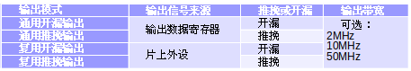
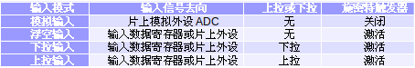
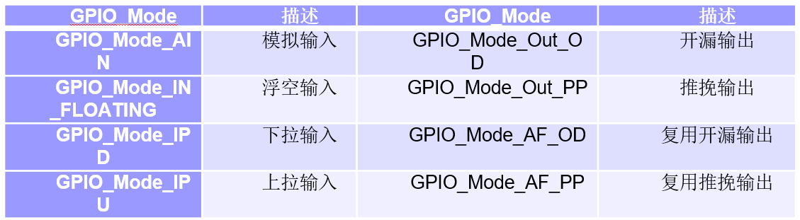

# GPIO接口

## 5.1 GPIO接口及特点

STM32F103RB芯片通用GPIO接口有PA、PB、PC和PD四种，统一可以写成Px。每个端口包括15个引脚，可以表示为Px0～Px15。

GPIO输出模式：



GPIO输入模式：



### 5.1.1 GPIO功能模式

推挽：P-MOS或N-MOS其中一个导通、另一个停止。导通损耗小，效率高。

开漏：输出端相当于三极管的集电极。

#### GPIO复用功能

指除了传输I/O并行数据外，还可用于串口、定时器接口和$I^2C$等其他接口。

#### GPIO数字输入模式

GPIO模式把数据输入到输入寄存器中，复用功能输入模式把数据输入到此复用功能的片上外设。

#### 模拟输入模式

模拟输入模式直接接收模拟电压信号，并将输入信号输入到片上外设ADC。

#### 推挽输出模式

两个参数相同的MOS管或晶体管，分别受两个互补信号的控制，在一个晶体管导通时，另一个截止；由于每次只有一个管导通，所以导通损耗小，效率高。

#### 开漏输出模式

开漏输出模式就是不输出电压，低电平时接地，高电平时不接地。如果外接上拉电阻,则在输出高电平时，电压会拉到上拉电阻的电源电压。

#### GPIO输出速度设定

有3中输出速度可选：2MHz、10MHz、50MHz。

#### 钳位功能

GPIO内部具有钳位保护二极管，作用是防止从外部引脚输入的电压过高或过低。

### 5.1.2 GPIO的特点

1. I/O口电平兼容性。
2. I/O口驱动能力。
3. I/O口可内部上拉、下拉设置，简化外部输入电路设计。
4. I/O口可配置为外部中断口。
5. 具有独立的唤醒I/O口。
6. I/O口具有锁存功能。
7. 具有侵入检测引脚。

## 5.2 GPIO寄存器和库函数

### 5.2.2 GPIO库函数

#### GPIO_init函数

根据GPIO_InitStruct中指定的参数初始化外设GPIOx寄存器。

其中输入输出模式的设置为：



示例：
```C
// 将PA1设置为推挽输出

// PortA时钟使能
RCC_APB2PeriphClockCmd(RCC_APB2Periph_GPIOA, ENABLE);

GPIO_InitTypeDef gpio_init;
gpio_init.GPIO_Pin = GPIO_Pin_1;
gpio_init.GPIO_Mode = GPIO_Mode_Out_PP;
gpio_init.GPIO_Speed = GPIO_Speed_50MHz;

GPIO_init(GPIOA, &gpio_init);
```

#### GPIO_SetBits函数

设置输出引脚为高电平。

示例：
```C
// 配置GPIOB口引脚1和15为高电平
GPIO_SetBits(GPIOB, GPIO_Pin_1 | GPIO_Pin_15);
```

#### GPIO_ResetBits函数

设置输出引脚为低电平。使用方法和上面的函数一致。

#### GPIO_ReadInputDataBit函数

读指定端口具体引脚输入数据。

```C
// 读取PORTB端口引脚5的值
u8 value;
value = ReadInputDataBit(GPIOB, GPIO_Pin_5);
```

综合示例程序：

```C
/*
    使用按钮控制LED灯亮灯灭。
    配置PA1口作为输出驱动LED1灯，配置PA0口作为输入读取按钮状态控制LED灯。
*/

// 使能PORTA时钟
static void rcc_init()
{
    RCC_APB2PeriphClockCmd(RCC_APB2Perph_GPIOA, ENABLE);
}

// 初始化PA1口为推挽输出驱动LED1灯
void led_init()
{
    rcc_init();
    GPIO_InitTypeDef gpio_init;
    gpio_init.GPIO_Pin = GPIO_Pin_1;
    gpio_init.GPIO_Mode = GPIO_Mode_Out_PP;
    gpio_init.GPIO_Speed = GPIO_Speed_50MHz;
    GPIO_init(GPIOA, &gpio_init);
}

// 初始化PA0口为上拉输入
void key_init()
{
    rcc_init();
    GPIO_InitTypeDef gpio_init;
    gpio_init.GPIO_Pin = GPIO_Pin_0;
    gpio_init.GPIO_Mode = GPIO_Mode_IPU;
    gpio_init.GPIO_Speed = GPIO_Speed_20MHz;
    GPIO_init(GPIOA, &gpio_init);
}

char readKey()
{
    // 按钮按下低电平，松开高电平
    return !GPIO_ReadInputDataBit(GPIOA, GPIO_Pin_0);
}

void led_light()
{
    GPIO_ResetBits(GPIOA, GPIO_Pin_1);
}

void led_dark()
{
    GPIO_SetBits(GPIOA, GPIO_Pin_1);
}

int main()
{
    rcc_init();
    led_init();
    key_init();
    while(1)
    {
        if (readKey())
            led_light();
        else led_dark();
    }

    return 0;
}

```

## GPIO口配置流程总结：

1. 初始化GPIO口时钟：RCC_APB2PeriphClockCmd()
2. 初始化GPIO口：

    对应初始函数中调用初始化GPIO口时钟函数。

    设置GPIO_InitTypeDef变量gpio_init结构中的GPIO_Mode、GPIO_Speed和GPIO_Pin等字段。

    调用GPIO_Init(GPIOx, &gpio_init)完成初始化。
3. 主函数中完成逻辑功能的实现。
