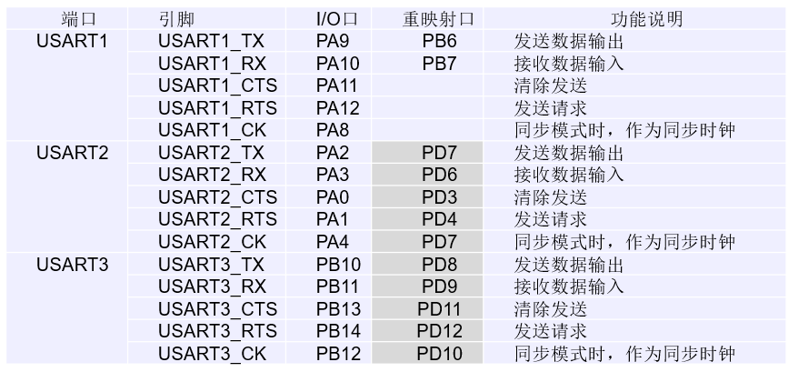

# 串行通信

串行通信是指在计算机总线或其他数据通道上，每次传输一个位元数据，并连续进行以上单次过程的通信方式。

### 同步与异步串行通信、波特率、校验与传输方式

#### 异步串行通信

异步串行通信所传输的数据格式由1个起始位、7 ~ 9个数据位、1 ~ 2个停止位和1个校验位组成，接收器和发送器有**各自的时钟**，工作是非同步的。

#### 同步串行通信

同步串行通信中，发送器和接收器由同一个时钟源控制。

#### 波特率

波特率BR是单位时间传输的数据位数，即单位：bps，1bps = 1bit/s。采用异步串行通信，互相通信甲乙双方必须具有相同的波特率，否则无法成功地完成数据通信。同步通信中通过主从设备的同步时钟完成数据同步，因此很少由波特率的说法。

#### 串行通信的校验

异步通信时可能会出现出错等情况，需要进行校验。

#### 数据通信的传输方式

单工、半双工、全双工。

## 7.1 通用同步异步收发器（USART）

### 7.1.1 USART概述

支持同步单向通信和半双工单线铜棍，也支持LIN等规范。RX：接收数据串行输入；TX：发送数据串行输出。

#### I/O口说明

STM32f103芯片由三组USART模块：USART1、USART2、USART3。在基本的异步串行通信过程中，只需要TX和RX这两个引脚便可以完成。在通信需要硬件流控模式时，此时还需要CTS和RTS两个引脚，这两个引脚对低电平都有效。



#### 时钟管理

为了使能USART模块的工作时钟，需要使能串口以及对应引脚的时钟。如使能USART1异步基本通信模式：
```C
RCC_APB2PeriphClockCmd(RCC_APB2Periph_USART1|RCC_APB2Periph_GPIOA|RCC_APB2Periph_AFIO, ENABLE);
```

#### 中断源

USART模块对应中断函数：

```C
void USART1_IRQHandler();
void USART2_IRQHandler();
void USART3_IRQHandler();
```

### 7.1.4 USART库函数

#### USART_Init函数

使用USART_Init对串口通信接口进行初始化。

例子：

```C
USART_InitTypeDef usart_init = {
    .USART_BaudRate = 9600,     // 波特率
    .USART_WordLength = USART_WordLength_8b,    // 数据8位
    .USART_StopBits = USART_StopBits_1,     // 1位停止位
    .USART_Parity = USART_Parity_No,        // 无奇偶校验
    .USART_HardwareFlowControl = USART_HardwareFlowControl_None, //无硬件流
    .USART_Mode = USART_Mode_Rx | USART_Mode_Tx,
};
USART_Init(USART1, &usart_init);
USART_Cmd(USART1, ENABLE);
```

## 7.2 USART操作

### 7.2.1 USART发送与接收

#### 数据发送器

当内核或DMA外设把数据写入到发送数据寄存器（TDR）后，发送控制器自动的把数据加载到发送移位寄存器中，然后通过串口线TX，把数据逐位送出去。当数据从TDR转移到移位寄存器时，会发生发送寄存器TDR已空事件TXE。当数据从移位寄存器全部发送出去时，会产生数据发送完成事件TC。

```C
void usart_send_byte(unsigned char data)
{
    USART_SendData(USART1, data);
    while(!USART_GetFlagStatus(USART1, USART_FLAG_TC));
}
```

#### 数据接收器

接收数据是从串口线RX逐位地输入到接收移位寄存器中，然后自动地转移到接收数据寄存器RDR，并会产生接收数据事件RXNE表示数据已收到，在查询到RXNE位置1后，把数据读取到内存中。

```C
unsigned char usart_recv_byte(void)
{
    while(!USART_GetFlagStatus(USART1, USART_FLAG_RXNE));

    return USART_ReceiveData(USART1);
}
```

## 7.4 USART应用实例

### 7.4.1 查询传送方式

```C
/*
    通过串口助手利用串口发送数据给微控制器，微控制器在接收到数据后，把数据送回给电脑。
    微控制器串口程序采用查询方式实现。
*/

// 时钟初始化

void rcc_init()
{
    RCC_APB2PeriphClockCmd(RCC_APB2Periph_USART1|RCC_APB2Periph_GPIOA|RCC_APB2Periph_AFIO, ENABLE);
}

// GPIO口初始化

void gpio_init()
{
    // PA9 复用TX引脚为输出口
    GPIO_InitTypeDef gpio_init;
    gpio_init.GPIO_Pin = GPIO_Pin_9;
    gpio_init.GPIO_Mode = GPIO_Mode_AF_PP;      // 复用推挽输出
    gpio_init.GPIO_Speed = GPIO_Speed_50MHz;
    GPIO_Init(GPIOA, &gpio_init);

    // PA10 复用RX引脚为输入口
    gpio_init.GPIO_Pin = GPIO_Pin_10;
    gpio_init.GPIO_Mode = GPIO_Mode_IN_FLOATING;
    GPIO_Init(GPIOA, &gpio_init);
}

// 串口程序初始化

void usart_init()
{
    // 初始化相应的时钟和GPIO口
    rcc_init();
    gpio_init();

    USART_InitTypeDef usart_init = {
        .USART_BaudRate = 9600,
        .USART_WordLength = USART_WordLength_8b,
        .USART_StopBits = USART_StopBits_1,
        .USART_Parity = USART_Parity_No,
        .USART_HardwareFlowControl = USART_HardwareFlowControl_None,
        .USART_Mode = USART_Mode_TX | USART_Mode_RX,
    };

    USART_Init(USART1, &usart_init);
    USART_Cmd(USART1, ENABLE);
}

// 串口发送和接收程序

void usart_send_byte(unsigned char data)
{
    USART_SendData(data);

    while(!USART_GetFlagStatus(USART1, USART_FLAG_TC));
}

unsigned char usart_recv_byte()
{
    while(!USART_GetFlagStatus(USART1, USART_FLAG_RXNE));

    return USART_ReceiveData(USART1);
}

// 主程序

int main()
{
    unsigned char data;
    usart_init();
    while(1)
    {
        data = usart_recv_byte();
        usart_send_byte(data);
    }
    return 0;
}
```

### USART查询方式总结

1. 初始化对应的时钟

    如果使用的是USART1，则需要初始化USART1时钟、GPIOA时钟以及AFIO复用时钟：

    RCC_APB2PeriphClockCmd(RCC_APB2Periph_USART1|RCC_APB2Periph_GPIOA|RCC_APB2Periph_AFIO, ENABLE);

2. 初始化TX、RX引脚对应的GPIO口

    如果使用的是USART1，则需要初始化PA9和PA10口。

3. 初始化USART

    初始化USART_InitTypeDef类型变量usart_init，修改以下字段：
    ```
    USART_BaudRate      // 波特率，一般为9600
    USART_WordLength    // 字长，一般为1个字节，即USART_WordLength_8b
    USART_StopBits      // 停止位数目，一般为1个，即USART_StopBits_1
    USART_Parity        // 是否启用奇偶校验，不启用则USART_Parity_No
    USART_HardwareFlowControl   // 是否启用硬件流控制，不启用则USART_HardwareFlowContorl_None
    USART_Mode          // 模式，基本方式使用TX、RX，即USART_Mode_TX | USART_Mode_RX
    ```

    调用USART_Init初始化：USART_Init(USART1, &usart_init);

    调用USART_Cmd使能USARTx：USART_Cmd(USART1)

4. 编写发送以及接收程序

    发送程序：

    调用USART_SendData(data)发送指定长度的数据，长度由初始化时指定，一般为unsigned char。而后循环查询状态寄存器是否发生TC事件：while(!USART_GetFlagStatus(USARTx, USART_FLAG_TC))

    接收程序：

    循环查询状态寄存器是否发生RXNE事件：while(!USART_GetFlagStatus(USART_FLAG_RXNE))。发生事件后，接收调用USART_Receive(USARTx)接收数据，在返回值返回。
