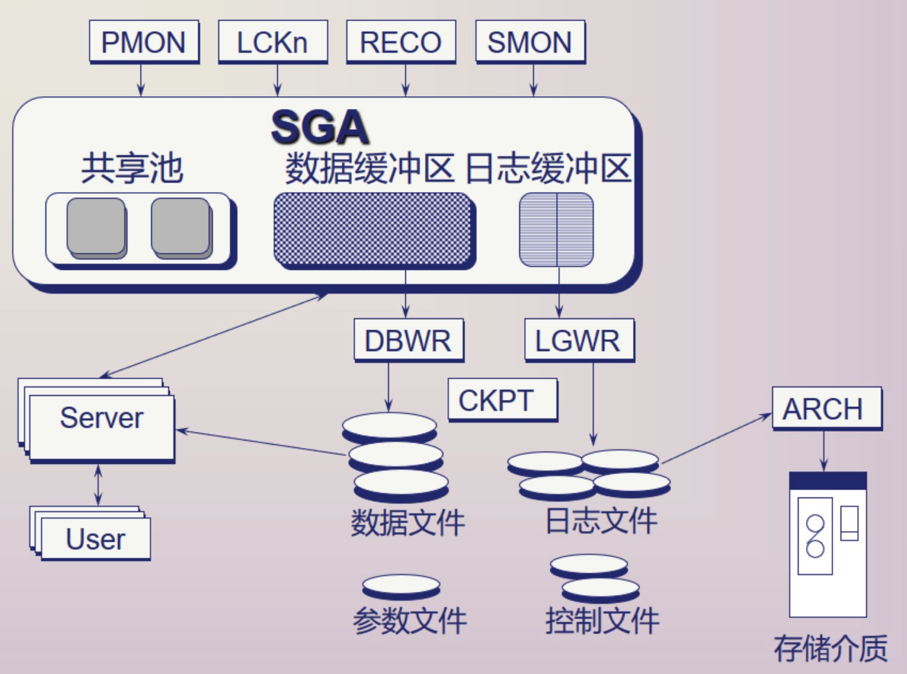
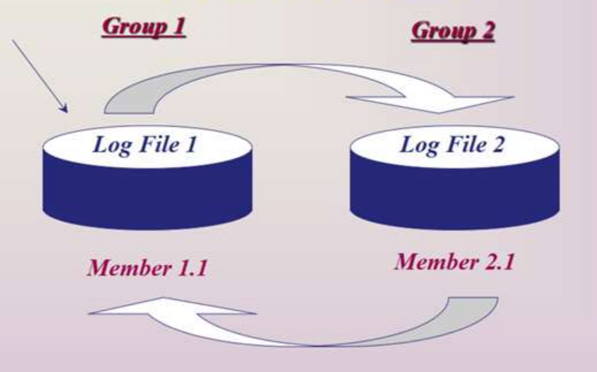
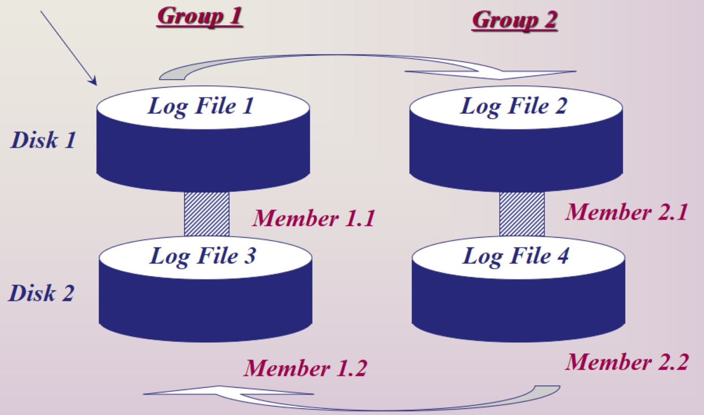
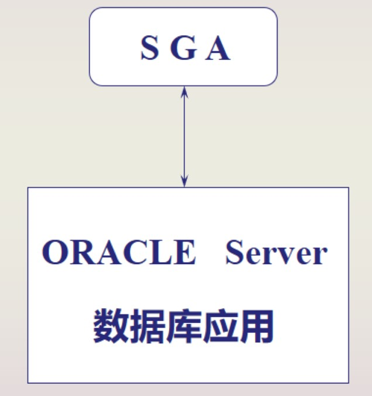
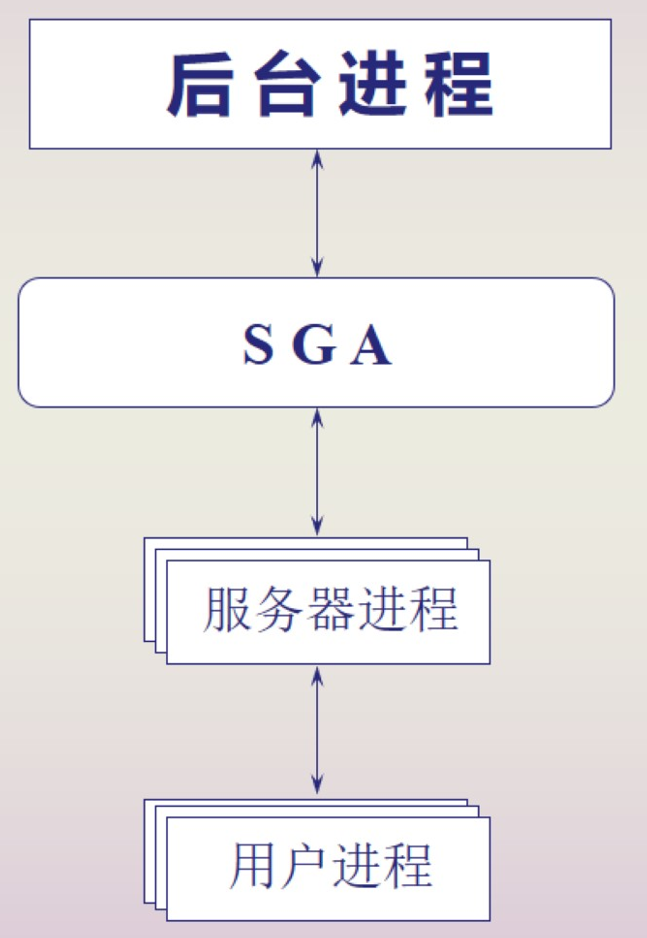
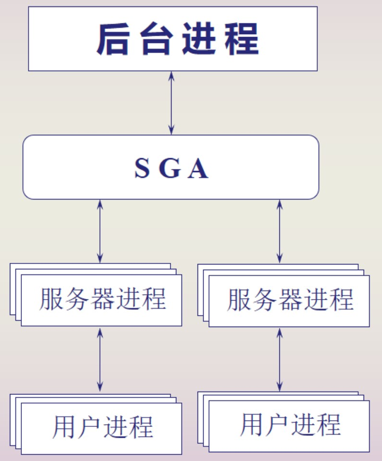
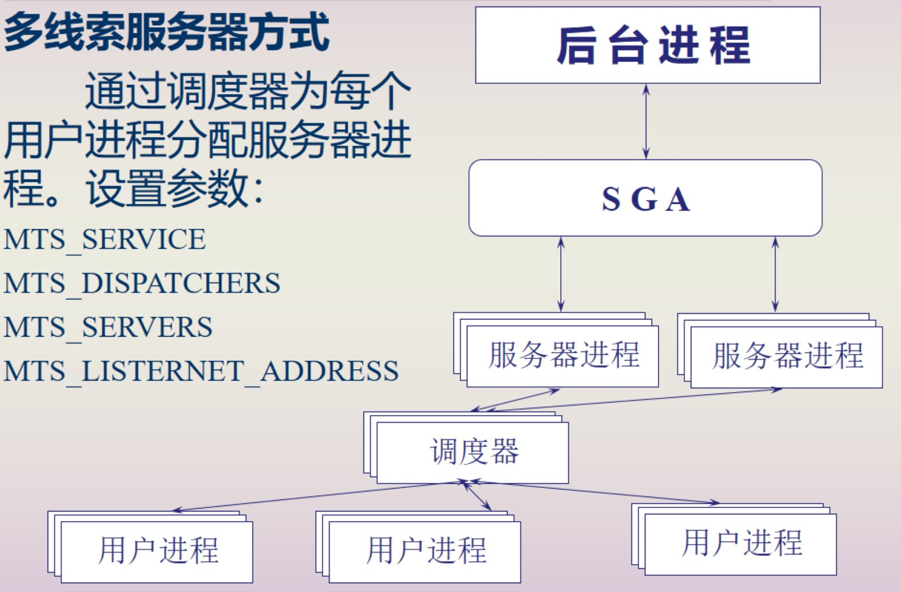
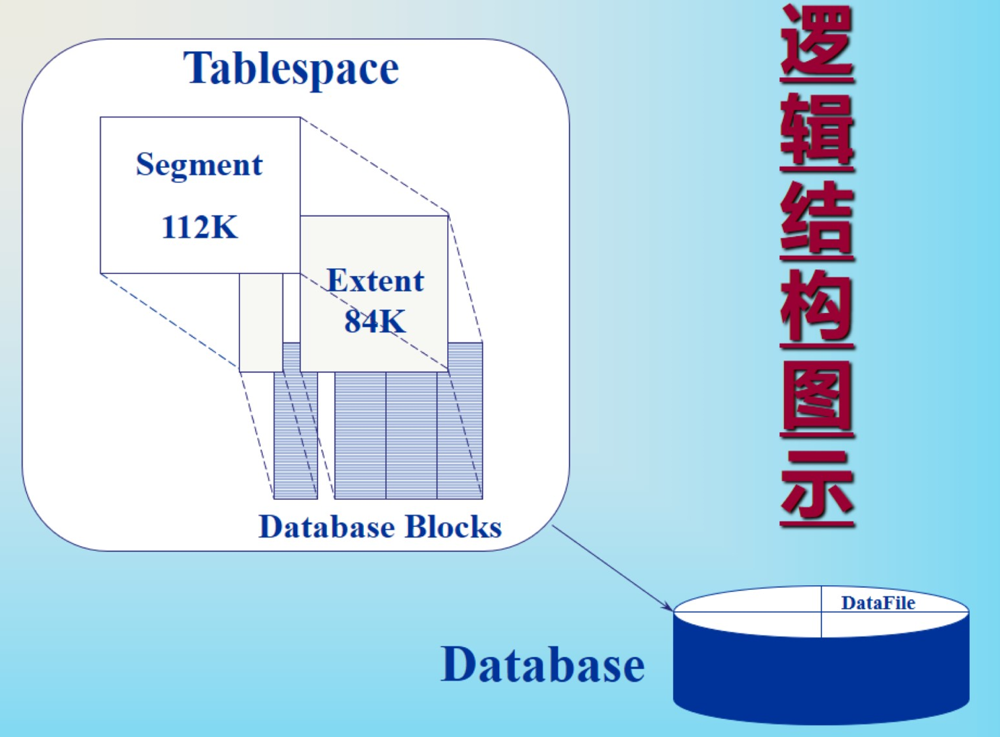
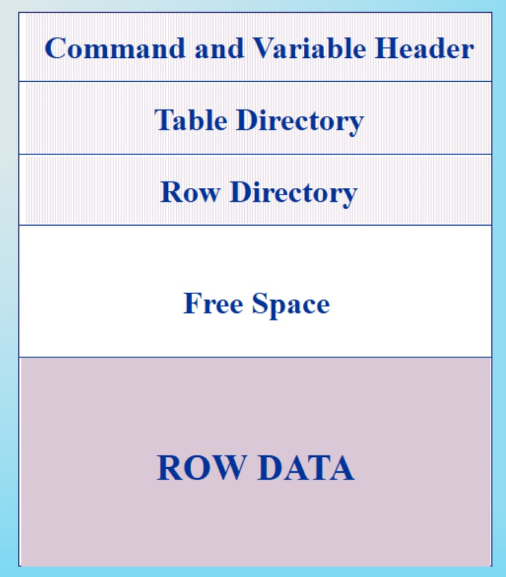

# ORACLE的体系结构

> [Oracle浅谈第三回](https://my.oschina.net/hcy8888/blog/901582/print)

DBWR: Data Base Writer，将Data Buffer中的数据写入到磁盘数据文件当中

LGWR: Log Writer，将日志缓冲内容写到磁盘的在线重做日志文件或组中

CKPT: Check Point，检查点，后台进程和恢复

ARCH: 归档程序

物理结构：数据文件、日志文件、控制文件、参数文件

系统全局区：共享池、数据缓冲区、日志缓冲区

进程：用户进程、服务器进程、后台进程

## 物理结构

数据文件、日志文件、参数文件、控制文件

### 数据文件

物理存储ORACLE数据库数据的文件，特点如下：

- 每个数据文件**只与**一个数据库相联系；
- 数据文件一旦被建立则**不能修改其大小**；
- 一个表空间可包含**一个或多个**数据文件。

### 日志文件

记录所有对数据库数据的修改，以备恢复数据时使用，特点如下：

- 每一个数据库**至少包含两个**日志文件组；
- 日志文件组以**循环**方式进行写操作；
- 每一个日志文件成员对应**一个物理文件**。

**日志开关**是为实现日志文件组的循环使用而设置的，出现日志开关的情况如下：

- 当一个日志文件被填满时；
- 关闭数据库时；
- DBA手动转移日志开关。

**镜像日志文件**是为了防止日志文件的丢失，在不同磁盘上同时维护两个或多个联机日志文件的副本。特点：

- 每个日志文件组至少包含两个日志文件成员；
- 每组的成员数目相同；
- 同组的所有成员同时被修改；
- 同组的成员大小相同，不同组的成员大小可不同。

### 控制文件

较小的二进制文件，用于描述数据库结构。

描述信息：数据库建立的日期、名字，所有数据文件和日志文件的文件名以及路径，恢复数据库时所需要的同步信息。

要点注意：

- 打开和存取数据库时都要访问该文件；
- 镜像控制文件；
- 记录控制文件名及路径的参数为：CONTROL_FILES。

### 参数文件

文本文件，只在建立数据库或者启动实例时才被访问，在修改该文件之前必须关闭实例。作用：

- 确定存储结构的大小；
- 设置数据库的全部缺省值、范围、物理属性；
- 优化数据库性能。

## 系统全局区

共享池、数据库缓冲区、日志缓冲区。

**实例（INSTANCE）**是存取和控制数据库的软件机制，它由**系统全局区**（SGA）和**后台进程**组成。

SGA是ORACLE系统为**实例**分配的一组**共享缓冲存储区**，用于存放数据库数据和控制信息，以实现对数据库数据的管理和操作。

### 共享池

共享池由**共享SQL区**和**数据字典区**组成，SHARED_POOL_SIZE确定共享池大小。

共享SQL区：SQL或PL/SQL语句的文本、语法分析形式及执行方案。

数据字典区：存放数据字典信息行。

### 数据缓冲存储区

用于存储从数据文件中读的数据的备份。

数据块的大小由DB_BLOCK_SIZE确定，一般为2K或4K；

DB_BLOCK_BUFFERS确定数据库块的数目。

数据缓冲存储区分为：

- 脏列表：包括被修改过的但尚未写到数据文件的缓冲块；
- LRU列表：包括空闲缓冲块、正在存取的缓冲块、已经被修改尚未移动到脏列表的缓冲块。

### 日志缓冲存储区

以记录项的形式备份数据库缓冲区中被修改的缓冲块，这些记录将被写到日志文件中。

LOG_BUFFER确定日志缓冲区的大小。

## 进程

ORACLE实例分为单进程实例和多进程实例。

**单进程/单用户**：一个进程执行全部ORACLE代码。

**多进程/多用户**：使用多个进程执行ORACLE的不同代码，对于每个连接的用户都有一个进程。

**专用服务器方式**：为每个用户单独加开设一个服务器进程，适用于实时系统。

**多线索服务器方式**：通过调度器为每个用户进程分配服务器进程。

### 用户进程

当用户运行一个应用程序时，就建立一个用户进程。

### 服务器进程

处理用户进程的请求。处理过程：

- 分析SQL命令并生成执行方案；
- 从数据缓冲存储区中读取数据；
- 将执行结果返回给用户。

### 后台进程

为所有的数据库用户异步完成各种任务，主要的后台进程有：

- DBWR：数据库写进程
- LGWR：日志写进程
- CKPT：检查点写进程
- SMON：系统监控进程
- PMON：进程监控进程
- ARCH：归档进程
- RECO：恢复进程
- LCKn：封锁进程

#### DBWR

将数据缓冲区中所有修改过的缓冲块数据写到数据文件中，并使用LRU算法来保持缓冲区中的数据块为最近经常使用的，以减少IO次数，该进程在启动实例时自动启动。

DBWR进行写操作的情况：

- 脏列表达到最低限制（DB_BLOCK_WRITE_BATCH的一半）
- 一个进程在LRU列表中扫描指定数目的缓冲块，未找到空闲缓冲块（DB_BLOCK_MAX_SCAN_CNT确定扫描数目）
- 出现超时
- 出现检查点

#### LGWR

将日志缓冲区中的所有记录项写到日志文件中。该进程在启动实例时自动启动。

LGWR进行写操作的情况：

- 用户进程提交一个事务；
- 日志缓冲区达到1/3范围；
- DBWR对一个检查点需要清除缓冲块；
- 出现超时。

#### CKPT

**检查点**：在检查点出现器件，DBWR进程将数据缓冲区中所有的脏缓冲块写到数据文件中，LGWR进程将日志缓冲区中所有的记录项写到日志文件中，以确保上一个检查点至今修改过的所有数据块都写到磁盘上。

CKPT进程在控制文件中记录检查点，参数CHECKPOINT_PROCESS确定了检查点的启动/不启动状态，若CKPT进程不启动，则该进程的工作将由LGWR进程代劳。

#### ARCH

在日志文件组出现切换时，将旧日志文件的内容拷贝到脱机存储介质上，出现介质失败时用于恢复数据。

#### SMON

System Monitor，负责完成自动实例恢复，该进程在启动实例时自动启动。

#### PMON

Process Monitor，撤销异常中断的用户进程，并释放该进程已获得的系统资源或锁。

#### RECO

Recover，在分布式操作的情况下，恢复一个失败的事务。

#### LCKn

Lock，在并行服务器系统间加锁，最多可加10个锁。

## 示例

处理SQL语句的**三个阶段**：语法分析、执行、返回指令。

为了支持读一致性、恢复和回滚，所有修改操作需要回滚段。修改操作的执行步骤：

- 将数据块送到数据缓冲区；
- 将回滚块送到数据缓冲区；
- 在修改行上设置锁；
- 保存回滚数据到回滚段块；
- 将修改写到数据块。

# ORACLE的逻辑结构

ORACLE的逻辑结构是由一个或多个表空间组成。

- 一个表空间由一组分类段组成；
- 一个段由一组范围组成；
- 一个范围由一批数据块组成；
- 一个数据块对应一个或多个物理块。

## 数据库块

数据库块（Database Blocks）是数据库使用的IO最小单元，又称逻辑块或ORACLE块。一个数据库块对应一个或多个物理块，块的大小由参数DB_BLOCK_SIZE确定。数据库块包含有：

- 标题：包括通用的块信息，如块地址、段类型等；
- 表目录：存储聚集中表的信息，这些信息用于聚集段；
- 行目录：包含块中的有效行信息；
- 自由空间：该块中能插入或修改的一组空间；
- 行数据：存储表或索引的数据。

## 范围

范围（Extent）是数据库存储空间分配的逻辑单位，一个范围由一组数据库块组成，范围是由段分配的，分配的第一个范围成为初始范围，以后分配的范围成为增量范围。

## 段

段（Segment）是表空间中一个指定类型的逻辑存储结构，它由一个或多个范围组成，段将占用并增长存储空间。

数据段中存储表或聚集的所有数据。

## 表空间

表空间（Tablespace）是数据库中物理编组的数据仓库，对应一个或多个数据文件，表空间的大小是它所对应的数据文件大小的总和。

ORACLE数据库中的数据逻辑存储在表空间中，物理存储在数据文件中。

# 数据库的安装

## DBA应用程序

**SQL*DBA**允许DBA控制和监视ORACLE数据库。（只有DBA特权的用户可以使用）

**SQL*Loader**将标准操作系统文件（文本文件或C数据格式文件）中的数据安装到ORACLE数据基表中。（DBA和用户都可以使用）

**Export/Import**允许DBA卸除/恢复ORACLE格式的数据

## ORACLE特殊用户

**internal**：只能在服务器端使用的超级用户，它具有DBA的所有特权，连接方式与普通用户相同。

**system（manager）**：建立数据库时自动建立的一个超级用户，拥有现实管理信息的附加表和视图，以及由ORACLE工具使用的酥油表和视图。连接方式与普通用户相同。

**sys（change_on_install）**：只能在服务器端使用的超级用户，它具有DBA的所有特权。连接方式与普通用户相同。

# 数据库的启动和关闭

## 数据库的启动

启动步骤：

- 启动SQL*DBA
- 连接INTERNAL用户
- 启动实例
  - 读参数文件
  - 分配SGA
  - 启动后台进程
  - 打开后台跟踪文件

启动方式：

- Open：启动实例、打开数据库、启动数据库
- Mount：启动实例、打开数据库
- Nomount：启动实例

## 数据库的关闭

关闭方式：

- Normal：处理完用户提交的所有事务，等待用户退出连接后，关闭数据库、卸载数据库、关闭实例。在下次启动实例时，不做实例恢复操作。
- Immediate/Abort Instance：结束正在处理的SQL语句、回滚未提交事务、不等待用户退出正常连接。在下次启动实例时，做实例恢复操作。

# 安全管理

## 特权管理

系统特权：完成特殊活动或在一个特殊类型的对象上完成特殊活动的一个特权。

对象特权：在一个指定的对象（表、视图、序列、过程、函数或包）上完成一个特殊活动的特权。

## 角色管理

角色是由一个命名的关联特权组组成，用来维护和控制特权，特点是：

- 减少授权次数
- 动态的特权管理
- 选择可用特权

# 数据库的后备和恢复

无归档操作：在介质出现失败时，只能将数据库恢复到最后后备的那一刻

归档操作：在介质出现失败时，能使用归档日志文件最大量的恢复数据库数据

