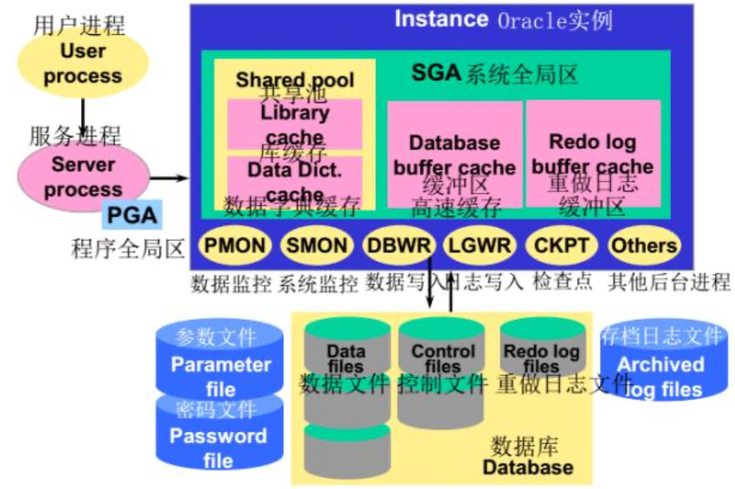

# 第一章

## 数据库发展的三个阶段

- 第一代：层次和网状；IMS、DBTG
  - 三级模式体系结构、存取路径表示数据联系、独立DDL、导航DML
- 第二代：关系数据模型的关系数据库
  - 组成部分：数据结构、关系操作、数据完整性
  - ER图设计数据库，SQL数据库语言
  - 局限性：模型过于简单、支持的基本数据类型有限、编程语言与操作语言分离
- 新一代：基本特征：支持面向对象数据模型、保持或集成第二代数据库技术、可扩展/移植/连接/操作。

## 数据库的发展

- 数据模型的发展
  - 扩充传统关系模型（1NF）、增加全新的数据构造器和数据处理原语、提出新的数据模型
- 数据库技术与其他相关技术的相结合（**什么是移动数据库、分布式数据库……**）
  - 分布式数据库：物理上分布在计算机网络各个节点上，逻辑上属于同一个系统的数据集合，具有数据的分布性和数据库间的协调性。
  - 移动数据库：在移动计算环境中的分布式数据库，在物理上分散，在逻辑上集中。
  - 并行数据库：在并行机上运行，具有并行处理能力。
  - 工程数据库、空间数据库……
- 面向领域的数据库新技术

## <u>*数据库技术新研究热点</u>

### <u>*NoSQL（什么是NoSQL？现在有哪些NoSQL产品？其优势和劣势，现状和前景）</u>

- **定义**：Non-relational，基于**非关系松散数据存储模型**的，**非关系型**、**分布式的**、**不满足ACID特征的**一类数据管理系统。

- **特点**：**高并发读写**、**高可用性**、**高可扩展性**、**海量数据高效存储和访问**。

- **优势**：**灵活的数据模型**（允许在一个数据单元内存储任何想要的结构）、**弹性扩展**、**经济性**（分布式和集群技术、廉价）。

- **劣势**：**不提供对SQL的支持**、**支持的特性不够丰富**、**现有产品不够成熟**。

- **产品**：Redis、HBase、CouchDB、MongoDB

- **NoSQL的核心思想：BASE模型/BASE思想、CAP理论**

### <u>*什么是BASE模型？什么是CAP理论？</u>

#### CAP理论

CAP，Consistency、Availability、Partition Tolerance：一致性、可用性、可靠性（分区容忍性）。对于一个分布式服务，不可能同时满足上述三种特性，只能同时满足其中的两个。

- C：一致性，任何时候数据的更新都要保持一致；
- A：可用性，服务随时可用且满足一定的性能要求；
- P：可靠性。

#### BASE模型/思想

强调基本的可用性，牺牲高一致性，获得可用性或可靠性。BASE思想包括以下方面：

- Basically Avaliable：基本可用；
- Soft-state：软状态、柔性事务：状态可以有一段时间不同步；
- Eventual Consistency：最终一致性，过程松，结果紧，最终结果必须保持一致性。

其他的数据库技术研究新热点：云数据管理、……

------

> **几种重要的数据模型**
>
> - 面向对象数据模型：语义数据模型+面向对象程序设计方法，OODB、ORDBS
> - XML数据模型
> - RDF数据模型：RDF，描述Web资源的标记语言。

------

# 第二章

## <u>*说明一般DBMS的层次结构</u>

- **应用层**：处理各种各样的数据库应用，是RDBMS与用户/应用程序的界面层；
- **语言翻译处理层**：处理数据库语言如SQL，向上提供的接口是元组的**集合**；
  - DB语句转换为对DBMS内层**可执行的基本存取模块的调用序列**。
  - 绑定时机：执行前（预编译，效率高独立性差）、执行时（解释，效率低独立性好，交互式SQL）
- **数据存取层**：处理**单个元组**，把集合操作化为单记录操作并执行；
  - 向上提供单元组接口，向下以系统缓冲区的存储器接口为实现基础
- **数据存储层**：处理数据页和系统缓冲区。
  - 缓冲区（内存+虚存）管理、内外存交换、外存管理
  - 缓冲区查找算法（顺序、折半、hash），缓冲区淘汰算法（LRU、FIFO、时钟……）

## <u>*Oracle的体系结构</u>

- **存储结构**：由**逻辑存储**、**物理存储**构成（数据库）
- **内存结构**：**SGA**（系统全局区）**+PGA**（程序全局区）。使用内存最多的是SGA，也是影响数据库性能最大参数
- **进程结构**：**用户进程**+**Oracle进程**

<u>**Oracle实例：内存结构+进程结构**</u>（但是从图上来说，更精确的应该是**SGA**+**后台进程**）

## <u>*存储结构（什么是Oracle的逻辑数据库结构和物理数据库结构？它们的主要组成有哪些？）</u>

### 逻辑存储结构

一个**层次结构**，指明怎么使用数据库的物理空间。

组成：数据库-表空间-段-区-数据库块

- 数据（库）块：IO最小单位，由一个或多个操作系统块组成；
- 段：是表空间中一个特定类型的逻辑存储结构；
- 表空间：最高层次的逻辑存储结构，oracle数据库由一个或多个表空间组成。一个表空间只属于一个数据库，每个表空间由一个或多个数据文件组成。

### 物理存储结构

指明数据库的物理空间构成。包含有：

- 控制文件：记录描述数据库的外部结构；
- 数据文件：每个数据文件只与一个数据库相联系，一个表空间可包含一个或多个数据文件，一个数据文件只能属于一个表空间；
- 重做日志文件：记录用户对数据库所进行的修改操作，可以利用这些日志修复数据库。Oracle以循环的方式向重做日志文件写入。

## 内存结构

### <u>*SGA（SGA包括哪些内容？可执行SQL放在SGA的哪个组件中？）</u>

在启动实例时分配，是实例的基本组件，由所有的服务进程和后台进程共享。构成：

- **共享池**：存储最近使用的SQL语句以及数据定义，构成：
  - 库缓存：最近使用的SQL语句
  - 数据字典缓存：最近使用的数据定义
- **缓冲区高速缓存**：从数据文件读出的数据块副本，缓存可以是：脏缓存块、空缓存块、命中缓存块
  - 通过两个列表管理：待写列表、最近最少使用列表
- **重做日志缓存**：保存还没写到磁盘的重做日志内容
- 大型池：供一次性大量的内存分配使用
- Java池：供各会话内运行的Java代码以及JVM内的数据使用

### PGA

在服务进程启动时分配，是每个服务进程和后台进程所私有的。

## 进程结构

### 用户进程

用户运行一个应用程序或Oracle工具时创建一个用户进程来运行用户的应用程序，用户通过用户进程与Oracle实例连接，用户进程通过服务进程和DB server通信。

### 服务进程

处理连接到实例的用户进程提交的请求。

### 后台进程

用于实现为多用户提供服务且保证系统性能：

- DBWn：数据写入进程
- LGWR：日志写入进程
- CKPT：检查点进程
- SMON：系统监控进程
- PMON：进程监控进程
- ARCn：归档进程

------

> **DB服务器**：一个实例+一个数据库
>
> **数据库**：三种类型文件组成：**控制文件**、**数据文件**、**重做日志文件**
>
> <u>**什么是序列？什么是同义词？**</u>
>
> 序列：自动产生的唯一数字，是一个共享对象，主要用于创建主键值；
>
> 同义词：一个对象的另一个名字，用于简化对对象的访问。

------

# 第三章

## <u>*数据库的安全性/基本要求有哪些？/数据库安全性的威胁？</u>

- **完整性**：防止对信息进行不恰当的修改；
- **可用性**：有合法权限的用户或者程序可以使用这些数据库对象；
- **机密性**：防止未授权的数据泄露。

## <u>*数据库的安全性措施有哪些？</u>

- **访问控制**：明确说明谁可以访问以及怎么访问
  - 策略：DAC、MAC、RBAC
- **推理控制**：防止通过统计数据推导出机密数据
- **流控制**：防止信息向未授权的用户流通
- **数据加密**：保护放在不安全介质中的数据，使用一些编码算法可以对数据进行编码。未经授权的用户很难从编码数据中破解出原文