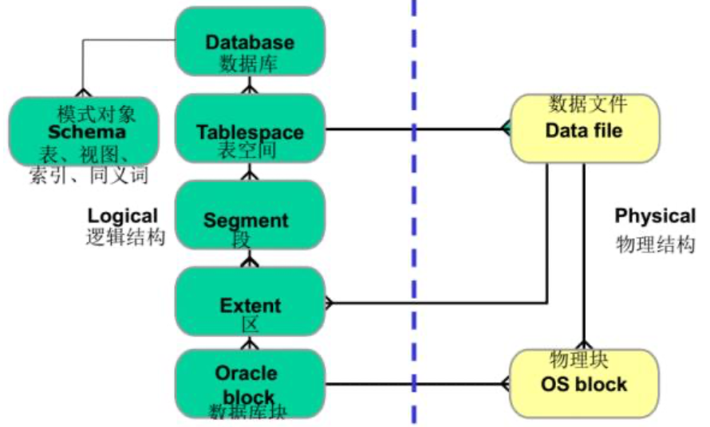

# 第一章

## 数据库发展的三个阶段

- 第一代：层次和网状；IMS、DBTG
  - 三级模式体系结构、存取路径表示数据联系、独立DDL、导航DML
- 第二代：关系数据模型的关系数据库
  - 组成部分：数据结构、关系操作、数据完整性
  - ER图设计数据库，SQL数据库语言
  - 局限性：模型过于简单、支持的基本数据类型有限、编程语言与操作语言分离
- 新一代：基本特征：支持面向对象数据模型、保持或集成第二代数据库技术、可扩展/移植/连接/操作。

## 数据库的发展

- 数据模型的发展
  - 扩充传统关系模型（1NF）、增加全新的数据构造器和数据处理原语、提出新的数据模型
- 数据库技术与其他相关技术的相结合（**什么是移动数据库、分布式数据库……**）
  - 分布式数据库：物理上分布在计算机网络各个节点上，逻辑上属于同一个系统的数据集合，具有数据的分布性和数据库间的协调性。
  - 移动数据库：在移动计算环境中的分布式数据库，在物理上分散，在逻辑上集中。
  - 并行数据库：在并行机上运行，具有并行处理能力。
  - 工程数据库、空间数据库……
- 面向领域的数据库新技术

## <u>*数据库技术新研究热点</u>

### <u>*NoSQL（什么是NoSQL？现在有哪些NoSQL产品？其优势和劣势，现状和前景）</u>

- **定义**：Non-relational，基于**非关系松散数据存储模型**的，**非关系型**、**分布式的**、**不满足ACID特征的**一类数据管理系统。

- **特点**：**高并发读写**、**高可用性**、**高可扩展性**、**海量数据高效存储和访问**。

- **优势**：**灵活的数据模型**（允许在一个数据单元内存储任何想要的结构）、**弹性扩展**、**经济性**（分布式和集群技术、廉价）。

- **劣势**：**不提供对SQL的支持**、**支持的特性不够丰富**、**现有产品不够成熟**。

- **产品**：Redis、HBase、CouchDB、MongoDB

- **NoSQL的核心思想：BASE模型/BASE思想、CAP理论**

### <u>*什么是BASE模型？什么是CAP理论？</u>

#### CAP理论

CAP，Consistency、Availability、Partition Tolerance：一致性、可用性、可靠性（分区容忍性）。对于一个分布式服务，不可能同时满足上述三种特性，只能同时满足其中的两个。

- C：一致性，任何时候数据的更新都要保持一致；
- A：可用性，服务随时可用且满足一定的性能要求；
- P：可靠性。

#### BASE模型/思想

强调基本的可用性，牺牲高一致性，获得可用性或可靠性。BASE思想包括以下方面：

- Basically Avaliable：基本可用；
- Soft-state：软状态、柔性事务：状态可以有一段时间不同步；
- Eventual Consistency：最终一致性，过程松，结果紧，最终结果必须保持一致性。

其他的数据库技术研究新热点：云数据管理、……

------

> **几种重要的数据模型**
>
> - 面向对象数据模型：语义数据模型+面向对象程序设计方法，OODB、ORDBS
> - XML数据模型
> - RDF数据模型：RDF，描述Web资源的标记语言。

------

# 第二章

## <u>*说明一般DBMS的层次结构</u>

- **应用层**：处理各种各样的数据库应用，是RDBMS与用户/应用程序的界面层；
- **语言翻译处理层**：处理数据库语言如SQL，向上提供的接口是元组的**集合**；
  - DB语句转换为对DBMS内层**可执行的基本存取模块的调用序列**。
  - 绑定时机：执行前（预编译，效率高独立性差）、执行时（解释，效率低独立性好，交互式SQL）
- **数据存取层**：处理**单个元组**，把集合操作化为单记录操作并执行；
  - 向上提供单元组接口，向下以系统缓冲区的存储器接口为实现基础
- **数据存储层**：处理数据页和系统缓冲区。
  - 缓冲区（内存+虚存）管理、内外存交换、外存管理
  - 缓冲区查找算法（顺序、折半、hash），缓冲区淘汰算法（LRU、FIFO、时钟……）

## <u>*Oracle的体系结构</u>

物理结构、系统全局区、进程。

> - **存储结构**：由**逻辑存储**、**物理存储**构成（数据库）
> - **内存结构**：**SGA**（系统全局区）**+PGA**（程序全局区）。使用内存最多的是SGA，也是影响数据库性能最大参数
> - **进程结构**：**用户进程**+**Oracle进程**

<u>**Oracle实例：内存结构+进程结构**</u>（但是从图上来说，更精确的应该是**SGA**+**后台进程**）

## <u>*存储结构（什么是Oracle的逻辑数据库结构和物理数据库结构？它们的主要组成有哪些？）</u>

### 逻辑存储结构

一个**层次结构**，指明怎么使用数据库的物理空间。

组成：数据库-表空间-段-区（范围）-数据库块

- 数据（库）块：IO最小单位，由一个或多个操作系统块组成；
- 段：是表空间中一个特定类型的逻辑存储结构；
- 表空间：最高层次的逻辑存储结构，oracle数据库由一个或多个表空间组成。一个表空间只属于一个数据库，每个表空间由一个或多个数据文件组成。

### 物理存储结构

指明数据库的物理空间构成。包含有：

- 控制文件：记录描述数据库的外部结构；
- 数据文件：每个数据文件只与一个数据库相联系，一个表空间可包含一个或多个数据文件，一个数据文件只能属于一个表空间；
- 重做日志文件：记录用户对数据库所进行的修改操作，可以利用这些日志修复数据库。Oracle以循环的方式向重做日志文件写入。
  - 日志开关：实现日志文件组的循环使用而设置的。
- 参数文件：确定存储结构大小、缺省值等等。

## 内存结构

### <u>*SGA（SGA包括哪些内容？可执行SQL放在SGA的哪个组件中？）</u>

在启动实例时分配，是实例的基本组件，由所有的服务进程和后台进程共享。构成：

- **共享池**：存储最近使用的SQL语句以及数据定义，构成：
  - 共享SQL区/库缓存：最近使用的SQL语句
  - 数据字典缓存：最近使用的数据定义
- **缓冲区高速缓存**：从数据文件读出的数据块副本，缓存可以是：脏缓存块、空缓存块、命中缓存块
  - 通过两个列表管理：待写列表（脏列表）、最近最少使用列表
- **重做日志缓存**：保存还没写到磁盘的重做日志内容
- 大型池：供一次性大量的内存分配使用
- Java池：供各会话内运行的Java代码以及JVM内的数据使用

### PGA

在服务进程启动时分配，是每个服务进程和后台进程所私有的。

## 进程结构

### 用户进程

用户运行一个应用程序或Oracle工具时创建一个用户进程来运行用户的应用程序，用户通过用户进程与Oracle实例连接，用户进程通过服务进程和DB server通信。

### 服务进程

处理连接到实例的用户进程提交的请求。

### 后台进程

用于实现为多用户提供服务且保证系统性能：

- DBWn：数据写入进程
- LGWR：日志写入进程
- CKPT：检查点进程
- SMON：系统监控进程
- PMON：进程监控进程
- ARCn：归档进程

------

> **DB服务器**：一个实例+一个数据库
>
> **数据库**：三种类型文件组成：**控制文件**、**数据文件**、**重做日志文件**
>
> <u>**什么是序列？什么是同义词？**</u>
>
> 序列：自动产生的唯一数字，是一个共享对象，主要用于创建主键值；
>
> 同义词：一个对象的另一个名字，用于简化对对象的访问。

------

# 第三章

## <u>*数据库的安全性/基本要求有哪些？/数据库安全性的威胁？</u>

- **完整性**：防止对信息进行不恰当的修改；
- **可用性**：有合法权限的用户或者程序可以使用这些数据库对象；
- **机密性**：防止未授权的数据泄露。

## <u>*数据库的安全性措施有哪些？</u>

- **访问控制**：明确说明谁可以访问以及怎么访问
  - 策略：DAC、MAC、RBAC
  - DAC：每个主体对对象的访问是事先定义的，基于用户的，Grant、Revoke；问题：扩展、收回、管理；强制存取策略
- **推理控制**：防止通过统计数据推导出机密数据
- **流控制**：防止信息向未授权的用户流通
- **数据加密**：保护放在不安全介质中的数据，使用一些编码算法可以对数据进行编码。未经授权的用户很难从编码数据中破解出原文
  - 对称加密（AES、……），非对称加密（RES、背包、……）

## <u>*什么是概要文件？解释概要文件的创建相关代码。</u>

概要文件是**密码管理**和**资源限制**的集合。

- 多个用户可以共享一个概要文件，一个oracle数据库中可具有数目不限的概要文件；
- 概要文件强制性地限制数据库中用户消耗的资源，并且帮助限制一个用户可同时打开的会话的数目、会话可持续的时间长度以及CPU和其他资源的使用。

创建概要文件：见数据库复习.pdf

## <u>*什么是细粒度数据访问？实现细粒度数据访问控制需要什么步骤或者条件？</u>

### 细粒度数据访问

- 两种机制：**应用环境**+**细粒度访问控制策略**
- Oracle使用虚拟专用数据库（VPD）来表示使用应用环境来实现细粒度访问控制策略，控制数据库对象的行级访问。

### 细粒度数据访问控制（FGAC）

也称为行级安全性，是一种可以根据数据内容限制访问的方法。使用策略函数有利于FGAC，策略函数附加到想保护的表或者视图上，它使用动态可修改的语句将用户约束或者限制在表、视图或同义词的某些成分中。在分析用户的SQL语句时，FGAC让Oracle自动估计策略函数，Oracle将在动态修改查询后执行它。

### 步骤

- 创建设置环境程序包
- 创建应用环境
- 设置用户初始环境
- 创建一个访问相应环境的程序包
- 创建安全策略
- 授权所有用户使用安全策略函数

## <u>*什么是VPD？实现VPD需要什么条件？什么是Oracle的虚拟专用数据库？</u>

VPD控制数据库的**行级访问**。每个用户只看到数据的某一部分，不同用户的过滤条件是不一样的，提供了比基于应用更强的安全性，通过直接附加安全策略（策略函数）到数据库对象来实施。使用某种**查询重写**来限制用户对数据库对象的访问。（VPD步骤与FGAC相同）

## <u>*什么是细粒度的审计？</u>

审计数据库：标准审计、细粒度审计

- 基于内容审计数据库中的活动
- 只针对满足一定条件的语句写审计记录

------

# 第四章

## 系统调优的最终目标

- 使应用运行的更快；
- 缩短查询/事务的响应时间；
- 提高事务的整体吞吐量。

## 查询优化

### 代数优化

关系代数表达式的等效代换。

### 物理优化

选择操作：简单的全表扫描、索引（或散列）扫描方法

#### <u>*连接操作方法（数据库有哪些数据连接操作方法？）</u>

- 笛卡尔连接（避免）：连接没有任何WHERE子句
- **嵌套循环方法**：选择一个表作为外表，另一表作为内表。对于外表的每一个元组，逐条扫描内表的记录，若满足连接条件则串接后作为结果输出，等同与两层循环。
  - 若有一个关系建立了索引，则将该关系作为内关系。
- **排序归并方法**：两表先按照连接属性排序，之后批量进行匹配（同样是需要一次扫描外表和内表，只是排序后扫描的量会降低）
- **索引连接方法**：同样是内外表的模式，只是外表中取出的元组，是根据索引找到内表中具有相同连接属性的元组的。
- **哈希连接方法**：把连接属性作为hash码，用同样的哈希函数把两个表中的元组散列到hash表的桶中再进行匹配连接。

选择依据：规则or代价

## 调优

### 索引的调优

基本原则：

- 将索引和数据放到不同的文件组；
- 组合索引的使用；
- 唯一索引与非唯一索引的差异；
- 非聚集索引的作用。

### 数据库设计的调优

逆规范化、垂直/水平划分、表和索引的分开存放、较大的表分开存放、尽量使用数字型字段

### 查询的调优

需要使用查询调优的典型情况：

- 查询导致过多的磁盘存取；
- 查询计划表明相关的索引没有被使用。

## Oracle数据库的调优

### <u>*Oracle性能调整的系统的方法有哪些？列举5个以上Oracle的数据库优化方法。</u>

- 正确设计应用程序
- 调整应用程序的SQL代码
- 调整内存
- 调整IO
- 调整争用和其他问题

### <u>*优化器Optimizer做些什么？</u>

CBO（Cost-Based Optimizer），帮助用户确定执行查询的有效方法。

- SQL转换
  - 转换为执行更有效的等价SQL语句
- 选择访问路径
  - 全表扫描、索引扫描、通过ROWID（伪列）对表进行访问
- 选择连接方式：嵌套循环、散列、排序归并
- 选择连接次序

### <u>*Oracle提供哪些有效的SQL写法？</u>

- 有效的WHERE子句
- 使用提示影响执行计划
- 选择最佳的连接方法
- 选择最佳的连接次序
- 索引的策略：使用合适的索引
- 监控索引的使用
- 使用相似的SQL语句
- 通过使用内嵌函数减少SQL开销
- 使用绑定变量
- 避免不合适的视图使用
- 避免不必要的全表扫描

### <u>*Oracle提供了哪些索引来应用到不同场合？索引的策略？索引选用原则？</u>

#### 什么时候索引

查询所检索的行数超过总行数的10%-15%可能就不需要索引

#### 怎么索引/建立什么的索引/在哪里建立索引

高选择性的列、所有重要的外键、所有谓词列、在表的连接中使用的列

#### 使用合适的索引

**B树索引**：**最常见、默认**。检索高基数数据列（列存在很多不同的值）

**位图索引**：一张表有**上百万**条数据且**低基数**、经常查询**含有or多个条件的组合**、**键只读或很少更新**

**索引组织表**：以**B树为索引结构存储数据的表**，包括**键和非键列**。基于**索引键的检索较快**，**减少了存储空间**。适用于需要根据**主键**来查询的情况。

**组合索引**：包括**一个以上列的索引**，有效改进where谓词的选择性。**若拼接的索引包含where列表中的所有列适用**。

**函数索引**：包含一个被oracle函数或表达式转换过的列。对于经常使用的语句包含有对某个列的函数或复杂表达式的情况是非常有效的。

**反向键索引**：B树索引的分支，适合于**带有大量插入操作**的数据库存在的性能问题。反转了索引码中每列的字节，索引码将会被分布到各个索引块中，从而减少争用。

# 第五章

## 故障类型

事务失败（逻辑错误、系统错误）、系统崩溃、硬盘故障。

## 故障恢复策略

系统故障或事务故障的恢复：UNDO、REDO

灾难性或磁盘失败的恢复：使用归档存储设备上的数据库备份进行恢复，并从备份日志重新应用或者重做已提交事务的操作来重构故障前数据库的最新状态。

## 磁盘块的高速缓存

缓存目录、脏位、钉住拔去位。

## 原位更新和镜像更新

原位更新：覆盖被修改数据项在磁盘上的旧值；

镜像更新：写到磁盘不同的位置，保存数据项的多个版本。

前像、后像

## WAL规则

日志协议规则，“先写日志”：

- 先写日志，保证原子性；
- 事务提交前将事务相关的所有日志记录写到稳定存储介质。持久性。

## <u>*什么是潜入/非潜入（steal/no-steal）和强制/非强制（force/no-force）</u>

确定何时把数据页从高速缓存写回磁盘。

## 延迟更新与即时更新

## <u>*为什么要使用检查点技术</u>

问题、解决、基本思想、静态检查点、动态检查点。

## <u>*理解ARIES恢复管理算法</u>

## <u>*ARIES使用了哪些技术减少恢复时间和减少检查点开销？</u>