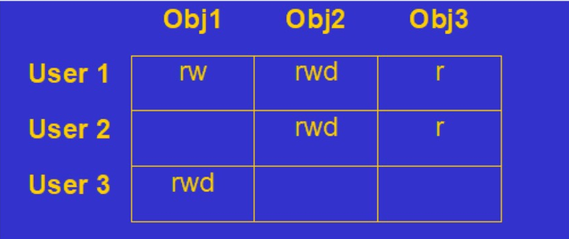

# 数据库安全概述

## 数据安全的基本要求

- 机密性：Confidentiality
- 完整性：Integrity
- 可用性：Availability

## 数据库的安全性措施

- 访问控制（Access Control）：明确说明谁可以访问及怎么访问；
- 推理控制（Inference Control）：防止通过统计数据推导出机密数据；
- 流的控制（Flow Control）：防止信息向未授权的用户流通；
- 加密控制（Cryptographic Control）：保护放在不安全介质中的数据。

数据库审计：记录应用到数据库的所有更新操作和实施每个更新操作的特定用户，以便找出非法的或未经授权的操作并确定执行该操作的帐号。

### 访问控制

不是所有的用户都能够访问数据库中所有的数据，确保对对象的所有访问都经过授权，避免通过读写数据和运行程序使数据遭到无意或恶意的破坏。

访问控制是基于所有者的概念，一个用户可以将他所拥有的对象授权给别人或收回权限。

访问控制假设：

- 认证（每个用户有适当的标识）；
- 访问权限的信息不被未经授权的修改。

#### 访问矩阵

- 对象：拥有数据的实体（文件、内存、元组等等）
- 主体：能够访问和处理对象的实体（用户、进程、IO设备）
- 每个对象和每个主体必须有一个唯一的ID
- 访问列表（access list）是与对象一起存储的访问矩阵的一列
- 能力列表（capability list）是与用户一起存储的访问矩阵的一行

#### 访问控制策略

**自主访问控制（DAC，Discretionary Access Control）**

- 每个主体对对象的访问是事先定义的；
- 基于用户的；
- 使用Grant和Revoke。

使用GRANT OPTION选项传播权限，为了限定传播，使用正整数i表示最多只能把权限授予给i个其他的账户。

DAC的缺点：可能存在数据的“无意泄漏”。

- 原因：这种机制仅仅通过对数据的存取权限来进行安全控制，而数据本身并无安全性标记。
- 解决：对系统控制下的所有主客体实施强制存取控制策略。

**多级安全性的强制访问控制**

每个数据对象分配一个**安全级别**，每个主体（用户或进程）分配一个**许可**；规则 Bell-Lapadula(BLP) Restrictions：

- 简单安全性性质：除非class(S)>=class(O)，否则主体S不能读取客体O；
- *性质：除非class(S)<=class (O)，否则主体S不能写客体O。

**强制存取控制（MAC，Mandatory Access Control）**

更高程度的安全性、用户不能直接感知或进行控制。

**基于角色的访问控制（RBAC，Role-Based Access Control）**

数据库角色：被命名的一组与数据库操作相关的权限。

- 角色是权限的集合；
- 可以为一组具有相同权限的用户创建一个角色；
- 简化授权的过程。

### 推理控制

允许访问综合性数据而禁止访问单个记录的详细机密性信息称为统计数据库安全性。相应的控制措施被称为推理控制。

防备策略：

- 查询控制
  - 任何查询至少要涉及N个以上的记录
  - 任意两个查询相交数据项不能超过M
  - 任一用户的查询次数不能超过1+(N-2)/M
- 条目控制
  - 抑制：包含敏感数据的查询被拒绝；
  - 隐藏：提供的答案是接近但不是准确的。
- 随机采样
- 随机数据污染
- 查询分析
- 没有一种完整的解决方案，所有的查询都带有某种信息
- 最后的防患——审计

### 流控制

防止信息向未授权的用户流通。当接受者的安全级别至少等于发送者的安全级别时，才能够把信息从发送者传递给接收者。流控制为每个运行的程序指派安全等级（许可证）。仅当程序的安全等级与特定内存段的安全等级一样高时，才允许用户访问内存段。仅当程序的安全等级与特定内存段的安全等级一样低时，才允许程序写入内存段。

## 数据加密

### 对称加密（Symmetric Algorithm）

加密和解密使用同一个密钥：如AES、3DES

### 不对称加密（Asymmetric Algorithm）

- 进行数据传输的双方都会生成一对自己的秘钥，然后二者把自己的公钥发送给对方。例如，A生成一对秘钥，然后把公钥给B，给B发送使用自己的私钥加密的数据，B收到后使用A的公钥解密。
- 加密解密速度比较慢，常用的算法有:RSA、Elgamal、背包算法、Rabin、D-H、ECC。

# Oracle的数据库安全

## 用户管理

概要文件（Profiles）是密码管理和资源限制的集合。

## 权限

权限是执行特定SQL语句或访问其他用户的对象的权利，有两种用户权限：

- 系统权限：赋予用户执行数据库中特定操作的权限
- 对象权限：赋予用户访问或操作特定对象的权限

REVOKE会同时收回使用WITH GRANT OPTION转授出去的权限。

> 1、with admin option
> with admin option的意思是被授予该权限的用户有权将某个权限(如create any table)授予其他用户或角色，取消是不级联的。
> 如授予A系统权限create session with admin option,然后A又把create session权限授予B,但管理员收回A的create session权限时，B依然拥有create session的权限。但管理员可以显式收回B create session的权限，即直接revoke create session from B.
>
> 2、with grant option
> with grant option的意思是：权限赋予/取消是级联的，如将with grant option用于对象授权时，被授予的用户也可把此对象权限授予其他用户或角色，不同的是但管理员收回用with grant option授权的用户对象权限时，权限会因传播而失效，如grant select on table with grant option to A,A用户把此权限授予B，但管理员收回A的权限时，B的权限也会失效，但管理员不可以直接收回B的SELECT ON TABLE 权限。

## 细粒度访问控制

两种机制来实施数据库的细粒度的安全：**应用环境**和**细粒度访问控制策略**。Oracle使用虚拟机专用数据库（VPD）来表示使用应用环境实现细粒度访问控制策略。

### 虚拟专用数据库

用户只能看到他们可以访问的数据，不同用户过滤条件是不一样的。

实现细粒度访问控制需要：设置应用环境的程序包、应用环境、访问应用环境的程序包、一组安全策略（VPD policy）。

## Oracle标签安全

Oracle允许你标记你的部分数据，用户只能被授权访问带有一定标记的数据。标记的使用使得容易标识哪些行可以被获取，访问规则成为策略。

## 审计数据库的使用

- 标准审计
  - 启用、打开、关闭、默认审计、用触发器定制数据库审计
- 细粒度审计
  - 基于内容审计数据库中的活动

## 加密

- 密码加密
- 数据加密