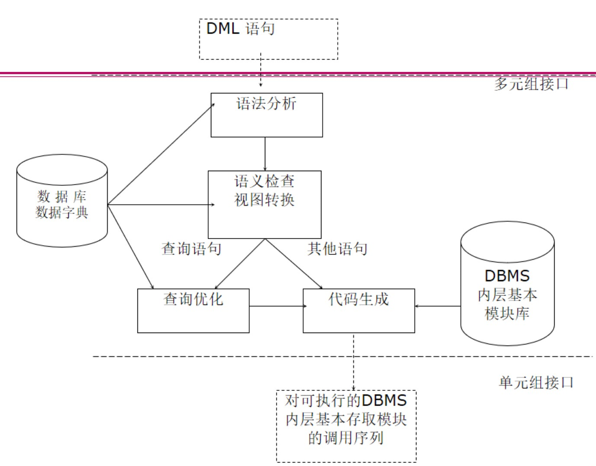
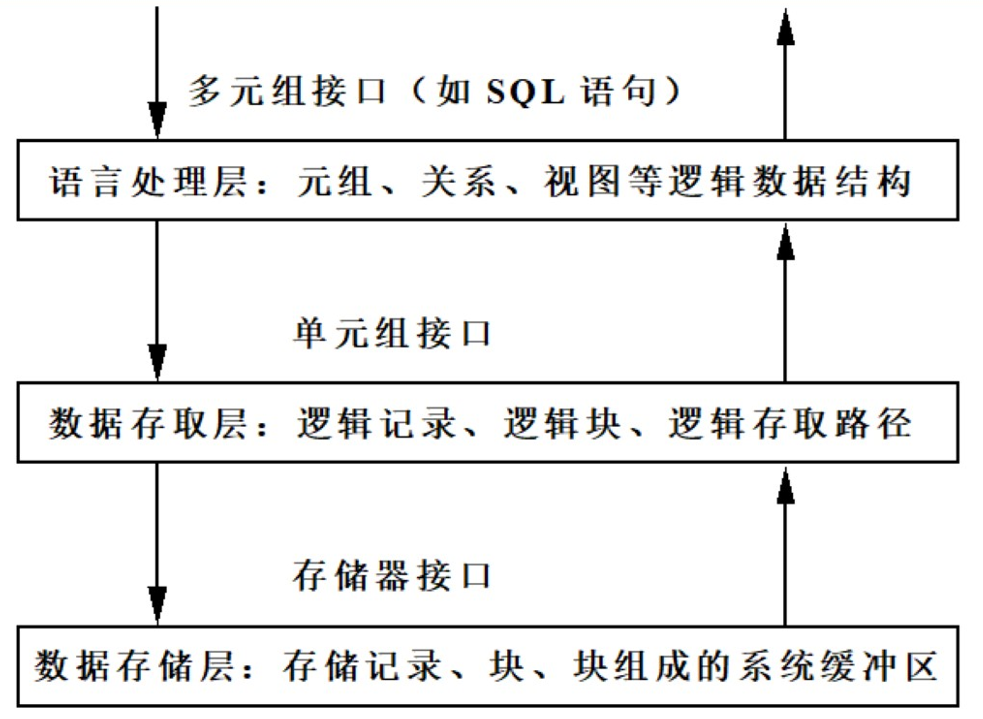

# DBMS的层次结构

**应用层**：处理各种各样的数据库应用，是RDBMS与用户/应用程序的界面层；

**语言翻译处理层**：处理数据库语言，如SQL，向上提供的数据接口是元组的集合；

**数据存取层**：处理单个元组，把集合操作化为单记录操作并执行；

**数据存储层**：处理数据页和系统缓冲区

## 语言处理层

### 语言处理层的任务和工作

接收DB语句（SQL），将其转换为**对DBMS内层可执行的基本存取模块的调用序列**。

DDL语句（数据定义语句，定义不同的数据段、数据库，如create）处理过程：

- 把它翻译成内部表示；
- 存储在系统的数据字典中。

DCL语句（数据控制语句，权限许可及访问级别的控制等，如grant，revoke）处理过程与DDL语句类似。

DML语句：数据操纵语句，如update、select等，对其的处理过程为：

将数据库DML语句转换成一串可执行的存取动作的过程，称为一个逐步绑定（bind）的过程。绑定时间分为执行时绑定（解释方法）和执行前绑定（预编译方法）。

绑定时间早：系统效率高，数据独立性差

绑定时间晚：数据独立性高，系统效率差

### 解释方法

执行前，DML语句都以原始字符串的形式保存。执行时，解释程序完成绑定过程，然后予以执行。

### 预编译方法

用户提交DML语句后，运行前对它进行翻译处理，保存产生的执行代码。在运行时，取出执行代码加以执行。

当预编译方法出现问题时（应用规划失效：数据库结构改变、存取路径改变），解决方法为重编译，重编译可以选择立即重编译或者在被执行时才进行自动重编译。自动重编译技术的优点为：

- 既拥有了编译时进行绑定所带来的高效率
- 又具备了执行时绑定带来的数据独立性

## 数据存取层

数据存取层介于语言处理层和数据存储层之间，它向上提供单元组接口，向下则以系统缓冲区的存储器接口作为实现基础：

存取层的任务：

- 提供一次一个元组的查找、插入、删除、修改等基本操作；
- 提供元组查找所循的存取路径以及对存取路径的维护操作；
- 对记录和存取路径的封锁、解锁操作；
- 日志文件的等级和读取操作；
- 其它辅助操作，如扫描、合并/排序等等。

## 数据存储层

功能：存储管理，包括：

- 缓冲区管理；
- 内外存交换；
- 外存管理。

系统缓冲区设立的原因：提供DBMS的设备独立性、提高存取效率。

系统缓冲区的组成：内存+虚存

### 缓冲区管理

缓冲区大小：

- 太大：占据内存空间
- 太小：频繁缺页调页，造成“抖动”，影响效率

缓冲区查找算法：顺序查找算法、折半查找算法、hash查找算法

缓冲区淘汰算法：LRU算法、FIFO算法、时钟算法、系统控制法、混合算法

## 数据库物理组织

衡量数据组织优劣的标准：

- 存储效率高：节省存储空间；
- 存取效率高：速度快，代价小。

存储的数据包括：数据描述、数据本身、数据之间的联系、存取路径

- 数据字典的组织
  - 数据量比较少
  - 使用频繁
  - 可简单地用顺序文件来组织
- 数据及数据联系的组织
  - 网状、层次数据库：邻接法和链接法
  - 关系数据库：表
- 存取路径的组织：关系数据库：B树类文件结构和Hash文件结构

# Oracle的体系结构

存储结构：由逻辑存储、物理存储组成

内存结构：由SGA、PGA组成

> SGA(System Global Area)：由所有服务进程和后台进程共享；
> PGA(Program Global Area)：由每个服务进程、后台进程专有；每个进程都有一个PGA。

进程结构：由用户进程和Oracle进程组成

内存结构+进程结构合称为Oracle实例。存储部分称为数据库。

## 系统结构组件

**DB服务器**：由一个实例和一个数据库组成

**实例**：用于数据库访问，由内存结构和进程结构组成。参数文件用于配置实例，参数文件中的参数决定了实例的大小和组成。

实例只能打开一个数据库，一个数据库可以有多个实例，如Oracle Real Application Clusters（RAC）。RAC通过运行多个实例共享存储在共享磁盘的单个物理数据库。RAC可以使得多个用户可以在多台机上访问单个数据库而又有较好的性能。

**数据库**：三种类型文件组成：控制文件、数据文件以及重做日志文件。

启动数据库的三个步骤：启动实例、装载数据库、打开数据库。

## 存储结构

### 逻辑数据库结构

表空间、模式对象、数据块、区和段

层次结构：数据库、表空间、段、区、数据块

#### 数据块

是IO最小单位，由一个或多个操作系统块组成，管理方式可以使自动段空间管理或者手工管理

#### 区

#### 段

段是表空间中一个指定类型的逻辑存储结构

#### 表空间

最高层次的逻辑存储结构，oracle数据库由一个或多个表空间组成。一个表空间只属于一个数据库，每个表空间由一个活多个数据文件组成。

### 物理数据库结构

数据文件、控制文件、重做日志文件

#### 控制文件

用于记录描述数据库的外部结构，包括数据库的名称和建立时间、数据文件和重做日志文件的名称及其位置，日志记录序列码等等。

#### 数据文件

每一个数据文件只与一个数据库相联系，一个表空间可包含一个或多个数据文件，一个数据文件只能属于一个表空间。

#### 重做日志文件

重做日志文件记录用户对数据库的所进行的修改操作，当数据库中的数据遭到破坏时，可以用这些日志修复数据库。

结构：循环结构，当一个日志文件满了之后，LGWR会到下一个日志文件中继续写入。

### 内存结构

SGA+PGA

SGA：实例启动时分配，是实例基本组件，可由所有的服务器进程和后台进程共享；

PGA：在服务器进程启动时分配，此区域是每个服务进程和后台进程所私有的，每个进程都有一个属于自己的PGA。

#### SGA

由几个内存结构组成：共享池、数据缓冲区、重做日志缓冲区

SGA中有两个可选的内存结构：大型池（large pool）、Java池（Java pool）

**共享池**：用于存储最近使用的SQL语句和最近使用的数据定义，它由两个与性能相关的内存结构组成：

- 库缓存：存储有关最近最常使用的SQL以及PL/SQL语句
  - 由LRU算法管理
  - 组成：共享SQL区域、共享PL/SQL区域
  - 大小与共享池大小有关
- 数据字典缓存：存储最近最常使用的数据库定义信息

**数据高速缓存**：用于存储从数据文件中读出的数据块副本

- 用于提高性能
- 使用LRU算法管理
- DB_CACHE_SIZE决定大小

缓存类型有：Dirty buffers、Free buffers、Pinned buffers（命中缓存块）

其通过两个列表管理：待写列表（Write list）、最近最少使用列表（LRU list）

**重做日志缓存**：用来保存还没有写到磁盘重做日志的内容

- 主要用于恢复
- 以重做条目的形式进行存储
- SGA内一块循环使用的缓冲区
- 大小由LOG_BUFFER决定

**大型池**：可选内存区域，供一次性大量的内存分配使用，是要用于备份与恢复操作、IO服务进程、并行执行缓存所需的存储空间等。不使用LRU列表。

### 进程结构

Oracle系统中的各种进程可以分为两大类：

- 用户进程：当用户运行一个应用程序或Oracle工具时启动；
- Oracle进程：服务器进程、后台进程

