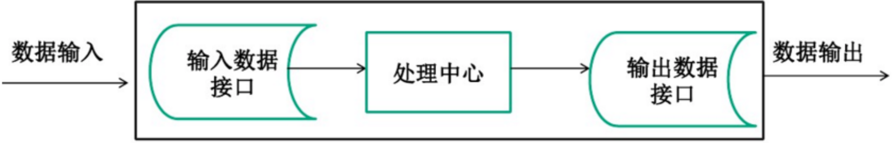
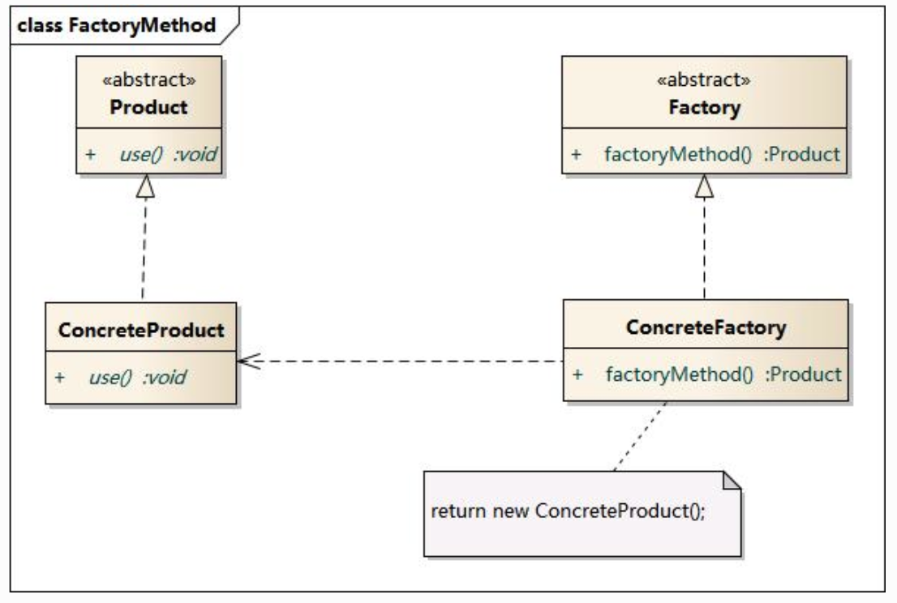
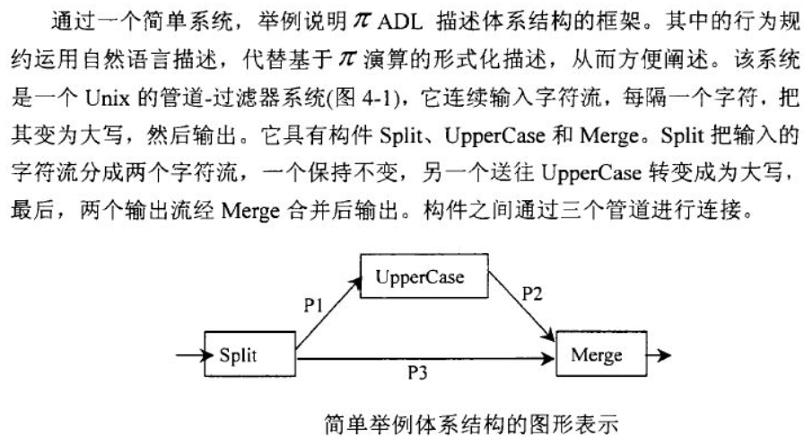
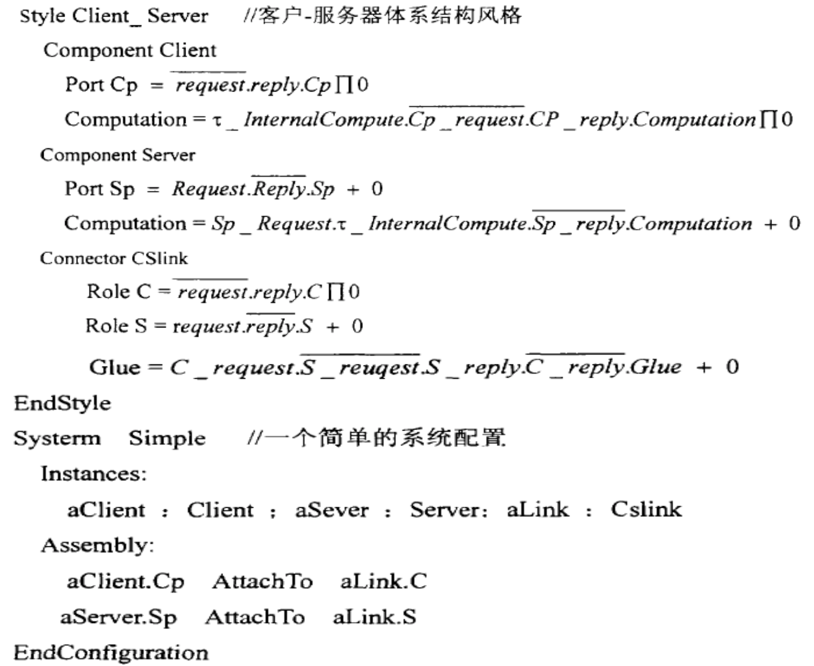
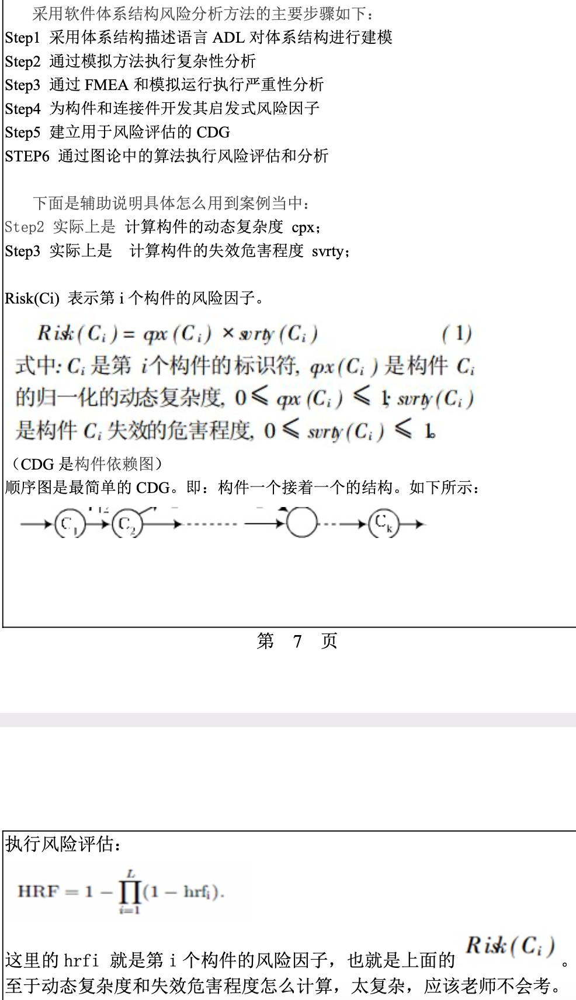

# 第一章

## <u>*详细了解什么是面向服务体系结构</u>

面向服务的体系结构（Service-Oriented Architecture，SOA）并不特指一种技术，而是一种**分布式运算的软件设计方法（或组件模型/软件体系结构）**。SOA将应用程序的不同功能单元（服务）通过这些服务之间定义良好的接口和契约联系起来。接口是采用中立的方式进行定义的，它独立于实现服务的硬件平台、操作系统和编程语言。这使得构建在各种这样的系统中的服务可以以一种统一和通用的方式进行交互。

### SOA的基本原则

**互操作性**：可以在不同环境中实现客户机和服务器。不必为了支持 Web Service 而更改现有代码。

**可重用**：见下。

**可组合性**：使用工作流程技术或者通过从 Web Service 实现调用下层 Web Service 可将简单 Web Service 聚集为更复杂的服务。

**松耦合**：见下

其他：可描述性、可发现性、自包含、可管理性

### SOA的基本特征

**松散耦合**、**可重用的服务**、**标准化的服务接口**、粗粒度的服务接口分级、服务接口设计管理、支持各种消息模式、精确定义的服务契约

### SOA的优点

1. **松耦合**。服务请求者到服务提供者的绑定与服务之间应该是松耦合的。因此，服务请求者不需要知道服务提供者实现的技术细节，例如程序语言、底层平台等等。一个松耦合系统中的每一个组件对其他独立组件的定义所知甚少或一无所知。
2. **可复用**。一个服务创建后能够用于多个应用和业务流程。
3. **组件化**。
4. **跨平台、跨语言**。服务可以使用任何语言来实现，也可以使用多种语言，但提供的接口统一，不管服务如何实现，应用只需要调用接口即可。

### 例子

SOA粗暴理解：把系统按照实际业务，拆分成刚刚好大小的、合适的、独立部署的模块，每个模块之间相互独立。

比如现我有一个数据库，一个JavaWeb（或者PHP等）的网站客户端，一个安卓app客户端，一个IOS客户端。

现在我要从这个数据库中获取注册用户列表，如果不用SOA的设计思想，那么就会这样：JavaWeb里面写一个查询方法从数据库里面查数据然后在网页显示，安卓app里面写一个查询方法查询后在app上显示，IOS同样如此。这里就会出现查询方法重叠了，这样的坏处很明显了，三个地方都有相同的业务代码，要改三个地方都要改，而且要改的一模一样。当然问题不止这一个。

于是乎出现了这样的设计思想，比如用Java（或者是其他语言皆可）单独创建一个工程部署在一台服务器上，并且写一个方法（或称函数）执行上述查询操作，然后使其他人可以通过某种途径（可以是http链接，或者是基于socket的RPC调用）访问这个方法得到返回数据，返回的数据类型是通用的json或者xml数据，就是说把这个操作封装到一个工程中去，然后暴露访问的方式，形成“服务”。

### 基于SOA的架构设计模式

SOAP：简单对象访问协议，一种交换数据的协议规范，HTTP+XML。

REST：表现层状态转换，HTTP+JSON

RPC：远程过程调用，基于socket。该协议允许运行于一台计算机的程序调用另一个地址空间（通常为一个开放网络的一台计算机）的子程序，而程序员就像调用本地程序一样，无需额外地为这个交互作用编程（无需关注细节）。RPC是一种服务器-客户端（Client/Server）模式，经典实现是一个通过发送请求-接受回应进行信息交互的系统。

------

### 1. 根据自己的经验，谈谈对软件危机的看法

目前软件危机主要体现在以下的四个方面：

1. **软件成本日益增长**。
2. **开发进度难以控制**。软件的开发需要建立庞大的逻辑体系，在软件开发过程中，用户需求变化等各种意想不到的情况层出不穷，令软件开发过程很难保证按照预定的计划实现，且盲目增加软件开发人员并不能成比例地提高软件开发能力。
3. **软件质量差**。软件即使能够按照预定日期完成，结果却不尽人意。
4. **软件维护困难**。在软件设计和开发过程中，没有严格遵循软件开发标准，随意性大；在软件使用过程中，原来的开发人员因各种原因离职，使得软件几乎不可维护。

造成软件危机的原因有：

1. **用户需求不明确**。用户对软件需求的描述不精确；开发过程中的需求修改；开发人员理解存在差异。
2. **缺乏正确的理论指导**。缺乏有力的方法学和工具方面的支持。
3. **软件规模越来越大**。开发人员不能有效地、独立自主地处理大型软件的全部关系和各个分支，容易产生疏漏和错误。
4. **软件复杂度越来越高**。

克服软件危机的方法：

面临的问题不但只是技术问题，更重要的是管理问题。必须采用**工程化的开发方法和工业化的生产技术**。在技术上，应该采用**基于重用的软件生产技术**；在管理上，应该采用**多维的工程管理模式**。

### 2. 就项目管理方面而言，软件重用项目与非重用项目有哪些不同之处。

# 第二章

## <u>*详细了解4+1视图</u>

“4+1”视图模型从5个不同的视角包括逻辑视图、进程视图、物理视图、开发视图和场景视图来描述软件体系结构。每一个视图只关心系统的一个侧面，5个视图结合在一起才能反映系统的软件体系结构的全部内容。

“4”：逻辑视图、开发视图、进程视图、物理视图

“1”（核心）：场景/用例视图、场景视图

视图：构件+连接件

逻辑视图和开发视图描述的是系统的静态结构，进程视图和物理视图描述的是系统的动态结构。对不同的软件系统来说，侧重点也不同。

### 场景

将4个视图有机联系起来，可以看作是**系统最重要的需求抽象**。可以帮助设计者找到体系结构的构建和它们之间的作用关系。

通常采用UML的用例图进行设计，可以正确识别系统的**用户**和**其他系统**、**系统边界**和**用例**，并对系统的功能场景进行充分的分析，以确定系统提供的功能可以满足用户需求。主要的元素：

- **系统边界**：确定系统的设计范围，通过边界识别出系统需要与用户或其它系统进行交互；
- **系统用户**：明确的用户定义是系统需求分析的先决条件；
- **功能和场景**：通过识别出系统与用户或其它系统的交互，可以分析出系统需要提供哪些功能，以及这些功能存在哪些应用场景。

### 逻辑视图

**主要支持系统的*功能需求*，即系统提供给最终用户的服务**。在逻辑视图中，系统分解成一系列的功能抽象，这些抽象主要来自问题领域。在面向对象技术中，通过抽象、封装和继承，可以用**对象模型**来代表逻辑视图，用**类图**来描述逻辑视图。（Booch标记法）

逻辑视图中使用的风格为面向对象的风格，需要注意的主要问题时要保持一个**单一的**、**内聚**的对象模型贯穿整个系统。

> 逻辑视图是对系统职责的逐级划分，以及对各逻辑元素之间的关系（接口）进行描述。

### 开发视图

也称为模块视图，主要侧重于**软件模块的组织和管理**，用**模块**和**子系统图**来表达，显示了“输出”和“输入”的关系。

在开发视图中，最好采用4-6层子系统，而且每个子系统仅仅能与同层或更低层的字系统通讯。对于各个层次，层次越低，通用型越强，这样可以保证应用程序的需求改变时，所做的改动最小。开发视图所用的风格通常是**层次结构风格**。

> 开发视图主要包括两部分信息：
>
> - 对逻辑架构元素，描述其代码位置，可以是代码仓位置，或代码目录，或是开源软件的版本信息等
> - 系统的构建，即如何将代码编译成二进制交付件（比如.so/.bin）。这个构建信息需要包括构建依赖、构建工具链、构建环境信息

### 进程视图

考虑一些非功能性的需求，如性能和可用性，定义逻辑视图中的各个类的具体操作是在哪一个线程中被执行。进程视图侧重系统的运行特性，服务于系统集成人员。

> 描述系统中的动态信息，常用UML的序列图来表示。

### 物理视图

主要考虑**如何把软件映射到硬件上**，考虑系统性能、规模、可靠性等。大型系统的物理视图可以与进程视图的映射一起以多种形式出现，也可以单独出现。

> 物理视图就是对软件系统在物理或软件环境上的部署。

------

# 第三章

## <u>*至少详细了解一种体系结构风格</u>

### *管道过滤器风格

#### 概述

每个构件都有一组输入和输出，构件读输入的数据流，经过内部处理，然后产生输出数据流。这个构件就是过滤器，这种风格的连接件就像是数据传输的管道，将一个过滤器的输出传到另一个过滤器的输入。

**过滤器**

基本结构：



过滤器对数据流具有五种变换类型：增加、删减、转换、合并、分解

**管道**

在过滤器之间传送数据：单向流、可能具有缓冲区。不同的管道中流动的数据流，具有不同的数据格式。

#### 基本构成

构件：过滤器，处理数据流。一个过滤器封装了一个处理步骤，而数据源点和数据终止点可以看作是特殊的过滤器。

连接件：管道，连接一个源和一个目的过滤器，转发数据流。

#### 过滤器

过滤器递增的读取和消费数据流，在输入被完全消费之前，输出便产生了。

**数据流的分类：推式（push）和拉式（pull）**

- 推式：前面的过滤器把新产生的数据推入管道；
- 拉式：随后的过滤器从管道中拉出所需数据；
- 推拉式：过滤器以循环的方式，从管道中拉出其输入数据，并将其处理产生的数据压入后续管道。

**过滤器的分类：主动与被动**：

- 主动过滤器：具有pull/push类型的过滤器（推拉式）；
- 被动过滤器：推式策略或拉式策略；
- 系统中至少有一个主动过滤器。

数据源点相当于主动过滤器：中间的过滤器及数据终点都是被动过滤器，推式策略。write()

数据终点相当于主动过滤器：中间的过滤器及数据源点都是被动过滤器，拉式策略。read()

混合型的管道-过滤器系统：数据源点和终点都是被动，中间存在至少一个主动过滤器。

**过滤器的设计**：停止、处理、等待、休眠状态。

#### 管道和过滤风格的优点

- 使得构件具有良好的隐蔽性以及高内聚、低耦合的特点；
- 允许设计者将整个系统的输入/输出看作是多个过滤器行为的简单叠加和组合，化繁为简；
- 支持软件重用，任何两个过滤器只要它们之间传送的数据遵守共同的规约就可以相连接；
- 系统维护和增强系统性能简单。新的过滤器可以添加到现有的系统，旧的可以被改进的过滤器替换掉；
- 支持并行执行，每个过滤器作为一个单独的任务完成，因此可与其它任务并行执行。

#### 管道和过滤器风格的缺点

- 通常导致进程成为批处理的结构；
- 不适合处理交互的应用；
- 在数据传输上没有通用的标准，使得每个过滤器增加了解析和合成数据的工作，导致系统性能下降，增加了编写过滤器的复杂性。

#### 典型应用举例——Unix pipes

在unix终端中，在两个命令之间利用“｜”将两个命令隔开，就形成了管道，而每一条命令都是一个过滤器。

在类Unix系统中，管道是一系列将标准输入输出链接起来的进程，其中每一个进程的输出被直接作为下一个进程的输入。管道实际上是一个伪文件（内核缓冲区）。

除此之外，典型的管道过滤器风格的应用还有：编译器、图像处理、信号处理等

#### 典型应用举例——编译器

编译器：一系列过滤器的连接体，按照管道-过滤器的体系结构进行设计。

过滤器：词法分析器、语法分析器、语义分析、中间代码生成器、优化器、目标代码生成器

------

# 第四章

## <u>*详细了解一种设计模式</u>

设计模式六大原则：

- 开闭原则
- 里氏代换原则
- 依赖倒转原则
- 接口隔离原则
- 迪米特法则（最小知道原则）
- 合成复用原则

## *创建型模式：工厂方法模式

在工厂模式中，创建对象时不会对客户端暴露创建逻辑，并且是通过使用一个共同的接口来指向新创建的对象。工厂模式是简单工厂模式的进一步深化，在工厂方法模式中，不再提供一个统一的工厂类来创建所有的对象，而是针对不同的对象提供不同的工厂。**每个对象都有一个与之对应的工厂**。

**为什么要使用工厂模式**

- **解耦**：把对象的创建和使用的过程分开；
- **降低代码重复**。
- **降低维护成本**。

### 定义

定义一个用于创建对象的接口，让子类决定将哪一个类实例化。工厂父类负责定义创建产品对象的公共接口，而工厂子类则负责生成具体的产品对象。工厂方法模式让一个类的实例化延迟到其子类。工厂方法模式可以允许系统在不修改工厂角色的情况下引进新产品。

### 工厂方法模式的角色分配

- 抽象工厂角色：工厂方法模式的核心，任何在模式中创建的对象工厂类必须实现这个接口。
- 具体工厂角色：实现抽象工厂接口的具体工厂类，包含与具体产品创建的相关逻辑，受到应用程序调用以创建某一种产品对象。
- 抽象产品角色：工厂方法模式所创建的对象的超类型，产品对象的共同父类或共同拥有的接口。
- 具体产品角色：实现了抽象产品角色所定义的接口。某具体产品有专门的具体工厂创建，它们之间往往一一对应。



### 实例：日志记录器

某系统日志记录器要求支持多种日志记录方式，如文件记录、数据库记录等，且用户可以根据要求动态选择日志记录方式，现使用工厂方法模式设计该系统。


------

# 第五章

## <u>*如何使用πADL进行动态体系结构建模？能使用一种动态描述语言对一个简单系统的体系结构进行描述。</u>

对下列简单系统使用πADL进行建模：



给出构件Split的πADL规约：

```
Component Split
	Port Input = [Read data until end-of-data is reached]
	Port Up = [Output data repeatedly]
	Port Down = [Output data repeatedly]
	Computation = [Repeatedly read from Input Port, then output into Port Up and Port Down alternatively]
```

连接管道Pipe的πADL规约：

```
Connector Pipe
	Role Source = [Deliver data repeatedly, signaling termination by close]
	Role Sink = [Read data repeatedly, closing at or before end of data]
	Glue = [Role Sink receives data in same order delivered by Role Source]
```

系统配置的规约：

```
System Capitalize
	Types:
		Component UpperCase
		Component Split
		Component Merge
		Connector Pipe
  Instances:
  	aSplit: Split
  	aUpper: UpperCase
  	aMerge: Merge
  	P1, P2, P3: Pipe
  Assembly:
  	aSplit.Up AttachTo P1.Source
  	aSplit.Down AttachTo P3.Source
  	aUpper.Input AttachTo P1.Sink
  	aUpper.Output AttachTo P2.Source
  	aMerge.Up AttachTo P2.Sink
  	aMerge.Down AttachTo P3.Sink
```


例子：使用πADL描述C/S风格



ACME对C/S的描述：

```
System simple_CS = {
	Component client={Port sendRequest}
	Component server={Port receiveRequest}
	Connector rpc={Roles{Roles{caller, callee}}
		Attachments:{
			client.sendRequest to rpc.caller;
			server.receiveRequest to rpc.callee
		}
	}
}
```

------

# 第六章

## <u>*在实际开发中，如何实现Web服务和SOA结构？</u>

基于SOA结构的三大Web服务技术：XML+XSD、SOAP、WSDL

## XML+XSD

Web服务采用http协议传输数据，采用XML格式封装数据，XML的主要优势事它与平台厂商无关。XSD用于定义标准的数据类型。Web服务使用XSD作为数据类型系统，当构造一个Web服务时，所使用的数据类型就必须被转换为XSD类型。

## SOAP

Simple Object Access Protocol，简单对象访问协议。SOAP不是简单的XML，而是经过SOAP标准改造之后得到的，SOAP可以在多种协议上传输，但大多数情况下是绑定在HTTP协议传输的。

## WSDL

Web Service Description Language，网络服务描述语言。基于XML的语言。

------

# 第七章

------

# 第八章

## <u>*软件体系结构测试是什么？熟悉使用抽象化学机进行测试的方法</u>

软件体系结构测试与程序测试有所不同， 它是**检查软件设计的适用性**，不考虑软件的实现代码，所以基于实现和说明的程序测试方法对软件体系结构测试并不适用。基于体系结构的软件测试需要研究测试内容、测试准则、测试用例、测试充分性及测试方法等问题。

测试内容：构件端口行为与连接件约束是否一致、兼容，单元间的消息是否一致、可达，相关端口是否可连接，体系结构风格是否可满足。

准则：测试覆盖的构件及各个构件的接口。各个连接件的接口、构件之间的直接连接、间接连接。

## 抽象化学机测试方法

### 定义

以化学为隐喻的抽象机，主要应用在异步并发计算模型。CHAM的反应规则基于多重集重写模型，由分子、溶液和变换规则构成。分子是化学抽象机的最小单位，而多个分子的集合则构成了溶液，变换规则是CHAM中溶液发生反应形成新溶液的依据。

### 过程

1. 构造CHAM的形式规格；
2. 定义初始溶液；
3. 定义终止溶液；
4. 定义反应规则；
5. CHAM导出带标号迁移系统（LTS）
6. 测试序列生成（状态/迁移覆盖）

详见16年试题及答案。

# 第九章

## <u>*详细了解一种体系结构风险分析方法。</u>

### ATAM：架构的权衡分析法

ATAM是评价软件架构的一种综合全面的方法。这种方法不仅可以**揭示出架构满足特定质量目标的情况**，还可以使我们更清楚地**认识到质量目标之间的联系**：如何权衡诸多质量目标。

#### 步骤

1. **描述ATAM方法**。

2. **描述业务动机**。项目经理从业务角度介绍系统概况。

3. **描述体系结构**。对体系结构进行介绍。

4. **确定体系结构方法**。评估小组通过理解体系结构方法来分析体系结构，并由设计师确定体系结构方法。（体系结构方法：代表了实现最高优先级的质量属性的体系结构手段）

5. **生成质量属性效用树**。确定系统最重要的质量属性目标，并对这些质量目标设置优先级和细化。

   质量属性效用树：

   根（效用）——质量属性——属性求精（细分）——场景（叶）。修剪这棵树，保留重要场景（不超过 50 个），再对场景按重要性给定优先级（用 H/M/L 的形式），再按场景实现的难易度来确定优先级（用 H/M/L 的形式），这样对所选定的每个场景就有一个优先级对（重要度，难易度），如（H，L）表示该场景重要且易实现。

   效用树中质量细分举例：

   - 性能：数据延迟、交易吞吐量
   - 可修改性：新产品目录、商业产品的改变
   - 可用性：硬件故障、商业软件故障
   - 安全性：数据机密性、数据完整性

6. **分析体系结构方法**。一旦有了效用树的结果，评估小组可以对实现重要质量属性的体系结构方法进行考察。

7. **讨论和分析场景优先级**。集体讨论并分析场景的优先级，该过程可能产生新的场景。（风险承担者：用例场景和改变场景）

8. **分析体系结构方法**。在收集并分析了场景之后，设计师就可以把新得到的最高级别的场景映射到所描述的体系结构中。若在第7步中未产生任何在以前的分析步骤中都没有发现的高优先级场景，则第8步就是测试步骤。

9. **描述评估结果**。

### SAAM：Software Architecture Analysis Method

SAAM是一种**非功能质量属性**的体系结构分析方法。SAAM的评估体系结构过程包括5个步骤：

1. **场景开发/形成场景**。
2. **描述体系结构**。
3. **对场景进行分类和确定优先级**。
4. **对间接场景的单个评估**。
5. **评估场景的相互作用**。
6. **总体评估**。
7. **SAAM评估日程安排**。

# 试卷与其它考点

## Java EE开发系统

Java EE开发系统是一个分层的分布式应用系统，可以看作是一个三层或四层的层次化系统。系统自上而下依次是：

1. 客户层（Client Tier）：主要用于处理用户交互。如应用客户端、动态HTML网页等。
2. Web层（Web Tier）：主要处理客户端的一些动作，控制页面跳转等，在客户层的需求在Web层也有实现。
3. 业务层（Business Tier）：主要处理实际的业务逻辑。
4. 数据与企业信息集成层（EIS Tier）：主要处理数据集成以及与现有系统的集成。

## 理解并比较构件分类的三种方法，如何在其中检索构件？每种方法各有什么优缺点？

1. **关键字分类法**。最简单的构件库组织方法，基本思想是：**根据领域分析的结果**将应用领域的概念按照从抽象到具体的顺序依次分解为树形或有向无回路图结构。优点是简单，易于实现。但在某些场合没有应用价值。
2. **刻面分类法**。定义若干用于**刻画构件特征的“面”**，刻面可以描述构件执行的功能，被操作的数据，构件应用的语境或任意其他特征。优点是易于实现相似构件的查找，但查询比较麻烦。
3. **超文本组织方法**。主要思想是：所有构件必须辅以详尽的功能或行为说明文档，说明中出现的**重要概念或构件以网状链接方式相互连接**。检索者在阅读文档的过程中可按照人类的联想思维方式任意跳转到包含相关概念或构件的文档。优点是比前两种方法更容易修改构件库的结构，但在某些情况下用户难以在超文本浏览过程中正确选取构件。

## 为什么要引入软件体系结构？

软件危机的出现以及软件系统的规模越来越大而复杂，对于一个**庞大复杂**的系统来说，**体系架构的规范设计**比起算法和数据结构的选择更为重要，传统的软件设计模式已经无法满足这种高需求，因此引入了软件体系结构。软件体系结构是**对行为和属性的高级抽象**，由**构成系统的元素的描述**、**元素的相互作用**、**指导元素集成的模式**以及**这些模式之间的约束**组成。体系结构是**风险承担者进行交流的手段**，也是**早期设计者决策的体现**，也是一种**可以传递和重用的模型**。

## 详细了解什么是Web服务体系结构

Web Service是基于HTTP和XML的一种服务，其**通信协议主要基于SOAP协议**，**服务的描述通过WSDL**，并**通过UDDI来发现和获得服务的元数据**。Web服务就像在web上的构件编程，开发人员通过调用web应用编程接口，将web服务集成进他们的应用程序，就像调用本地服务一样。

Web服务包括五个逻辑层：

- **数据层**：保存物理数据；
- **数据访问层**：为业务层提供数据；
- **业务逻辑层**：提供业务面使用的服务；
- **业务面**：到底层业务对象的接口；
- **监听者**：接收并解析带有请求服务的信息，发送给业务面响应的方法。

一个完整的Web服务包括三种逻辑构件：

- **服务代理**：起中介作用。是服务的注册构件；
- **服务请求者**：可在应用程序中通过服务代理请求服务，调用所需服务；
- **服务提供者**：提供服务，并进行注册以使服务可用。

Web服务的技术核心与服务栈：

- XML，可扩展标记语言，编码格式，解决数据怎么表示的问题；
- SOAP，简单对象访问协议，消息格式，解决数据怎么传输的问题；
- WSDL，web服务描述语言，描述服务，解决web服务怎么描述的问题；
- UDDI，统一描述，发现和集成协议，发现服务，解决在哪里，怎么获取需要的信息的问题。

传输协议使用HTTP。

优点：允许**在不同平台上使用不同编程语言**以一种基于标准的技术开发程序，来与其他应用程序通讯；其次具有高度的通用性，易用性和集成性。

## 详细了解一种体系结构风险分析方法

相关文章：

https://pdfs.semanticscholar.org/9b67/10c7a5fe98c675c610c7f473e61a4dcc1cb1.pdf

简化版：

